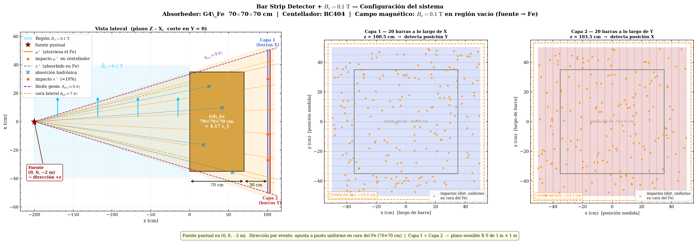
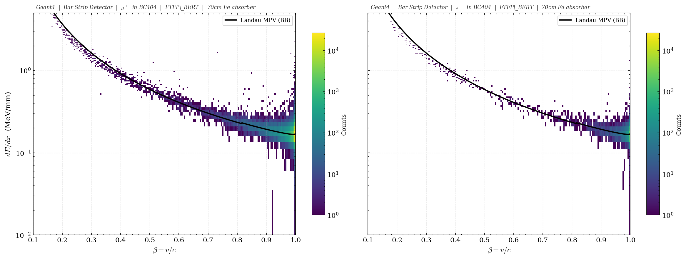
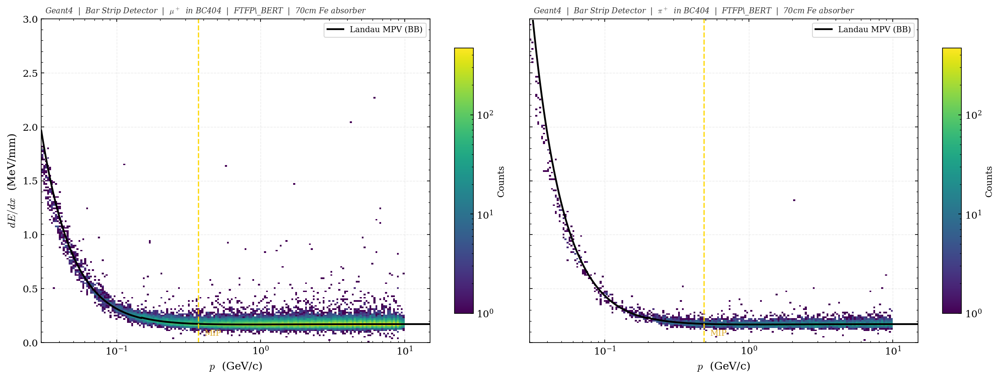
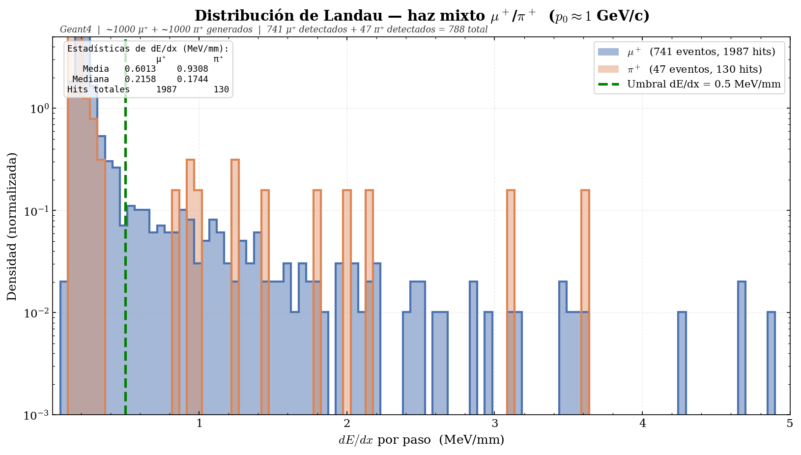
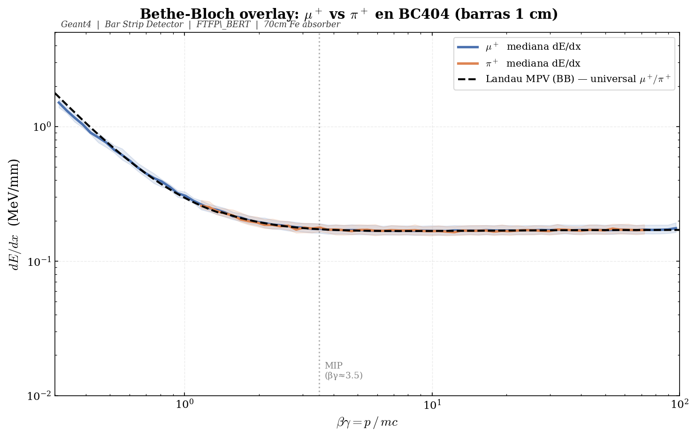
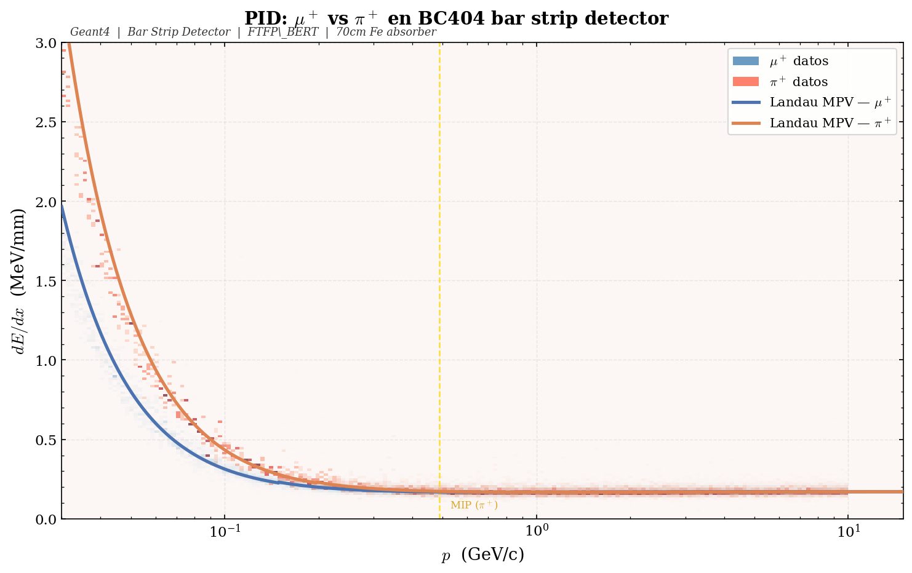
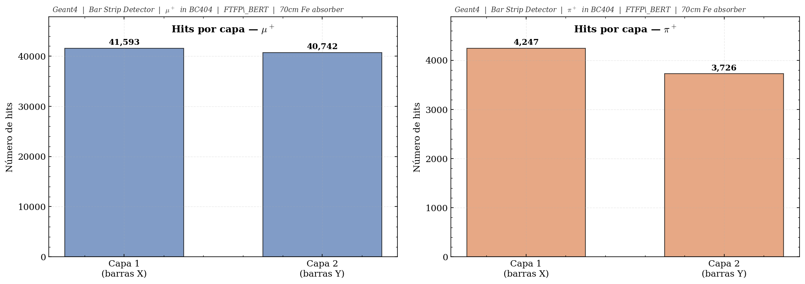
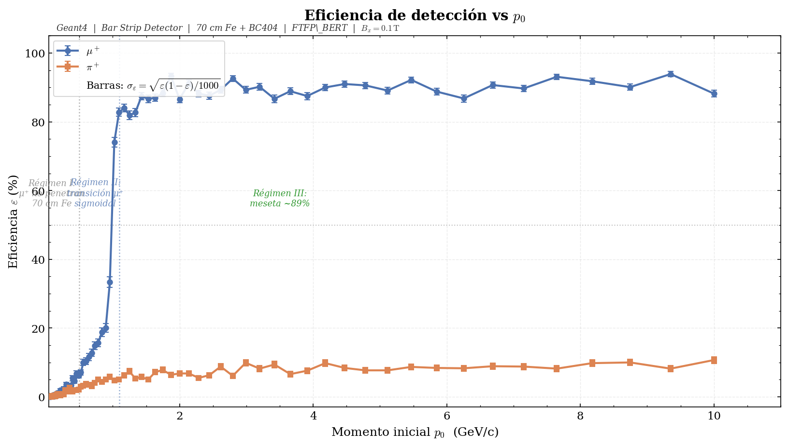
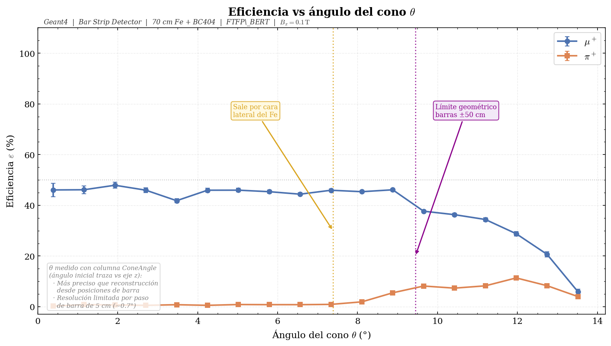

<div align="center">

[](#bar-strip-detector--haz-mixto-μπ-con-campo-bx--01-t)
[](#bar-strip-detector--mixed-μπ-beam-with-bx--01-t-field)

[Geometría](#distribución-del-sistema) ·
[Campo B](#campo-magnético-bx--01-t) ·
[NTuple](#columnas-del-ntuple-hits) ·
[Compilar](#compilación-y-ejecución) ·
[Resultados](#resultados)

</div>

---

<details open>
<summary>🇪🇸 Versión en español</summary>

# Bar Strip Detector — haz mixto μ⁺/π⁺ con campo Bx = 0.1 T

La misma simulación del Bar Strip Detector pero con un campo magnético uniforme de 0.1 T apuntando en +x. No es mucho — una décima de tesla — pero basta para curvar las trayectorias de baja energía y cambiar dónde caen las partículas en las barras centelladoras.

---

## Distribución del sistema

```
[fuente cónica, z = −2 m]  →→→  [Fe 70×70×70 cm]  →→→  [vacío 30 cm]  →→→  [Capa 1]  [Capa 2]
                                  z = 0–70 cm                              z = 100.5 cm  z = 103.5 cm

  Campo Bx = 0.1 T aplicado en todo el volumen (zona azul en el diagrama)
```



*Vista lateral: el campo magnético Bx = 0.1 T aparece en la zona azul entre la fuente y el detector. Las flechas azules indican la dirección del campo (+x). Las partículas cargadas se curvan según la fuerza de Lorentz q(v × B), aunque con 0.1 T el efecto es sutil y solo se nota en partículas lentas o de bajo momento.*

### Mundo

Vacío (G4_Galactic), 4 m × 4 m × 6 m. Campo magnético uniforme Bx = 0.1 T aplicado globalmente.

### Absorbedor de hierro

Cubo de G4_Fe, 70 × 70 × 70 cm, centrado en z = 35 cm.

- 70 cm de Fe = 4.17 longitudes de interacción nuclear (λ_I = 16.77 cm). Probabilidad de que un pión pase sin interacción hadrónica: exp(−4.17) ≈ 1.5%.
- El rango de un muón de 500 MeV/c en Fe es ≈ 50 cm; a 700 MeV/c supera los 70 cm y atraviesa.

### Detector activo — 2 capas de BC404

| Parámetro | Valor |
|---|---|
| Material | G4_PLASTIC_SC_VINYLTOLUENE (BC404, ρ = 1.032 g/cm³) |
| Dimensiones de cada barra | 1 m largo × 5 cm ancho × 1 cm grosor |
| Barras por capa | 20 |
| Cobertura transversal | 1 m × 1 m |
| Capa 1 | Barras a lo largo de X, posicionadas en Y, z = 100.5 cm |
| Capa 2 | Barras a lo largo de Y, posicionadas en X, z = 103.5 cm |
| Separación entre centros (Capa 1 → Capa 2) | 3 cm |
| Gap libre entre superficies | 2 cm |

Los centros de barra van de −47.5 cm a +47.5 cm en pasos de 5 cm.

---

## Campo magnético Bx = 0.1 T

El campo se define en `construction.cc` dentro de `ConstructSDandField()`:

```cpp
G4MagneticField* magField =
    new G4UniformMagField(G4ThreeVector(0.1*tesla, 0., 0.));

G4FieldManager* fieldMgr =
    G4TransportationManager::GetTransportationManager()->GetFieldManager();

fieldMgr->SetDetectorField(magField);
fieldMgr->CreateChordFinder(magField);

// Ajustes para bajos momentos
fieldMgr->GetChordFinder()->SetDeltaChord(1.0*mm);
fieldMgr->SetMinimumEpsilonStep(1e-4);
fieldMgr->SetMaximumEpsilonStep(1e-2);
```

Dirección: +x (transversal al haz). Magnitud: 0.1 T.

El radio de curvatura de una partícula relativista en un campo B es R = p / (qB). Para un muón de 100 MeV/c en 0.1 T: R ≈ 3.3 m. En la distancia de 2 m entre fuente y detector, la desviación lateral es del orden de unos centímetros — suficiente para mover un hit de una barra a otra, pero no tanto como para sacar la partícula del array completo.

Los parámetros de `DeltaChord` y `epsilonStep` están ajustados para que Geant4 no se vuelva loco con pasos infinitesimales cuando las partículas de bajo momento empiezan a hacer espirales.

---

## Definición de un hit

Igual que en la versión sin campo: la partícula primaria (TrackID = 1) tiene que atravesar el hierro, entrar en una barra de Capa 1, cruzar el gap, y entrar en una barra de Capa 2. Lo que cambia con el campo B es *dónde* cae — el barID puede ser distinto al que sería sin campo.

- `fEdep`: energía depositada en el paso → MeV
- `fdEdx`: energía por unidad de longitud → MeV/mm = fEdep / longitud del paso

---

## Archivos fuente

Todos en `simulation_mixed/`.

| Archivo | Qué define |
|---|---|
| `construction.cc / .hh` | Geometría completa + campo magnético Bx = 0.1 T |
| `detector.cc / .hh` | Detector sensible: registra cada paso y llena el NTuple |
| `generator.cc / .hh` | Fuente puntual en (0, 0, −2 m), selección 50/50 μ⁺/π⁺, dirección cónica |
| `physics.cc / .hh` | Lista de física: G4EmStandardPhysics + FTFP_BERT + G4OpticalPhysics |
| `run.cc / .hh` | Apertura del archivo ROOT por run, 15 columnas del NTuple |
| `action.cc / .hh` | Inicialización de acciones |
| `sim.cc` | `main()` |
| `barrido_continuo.mac` | Macro: 80 runs de 50 MeV/c a 10 GeV/c, 2000 eventos por run |

---

## Fuente de partículas — haz cónico

Punto único en (0, 0, −2 m). Cada evento elige μ⁺ o π⁺ con probabilidad 50/50, y la dirección apunta a un punto aleatorio en la cara frontal del Fe (±35 cm en X e Y). Ángulo del cono: 0° a ≈ 13.9°.

```cpp
G4double tx = (G4UniformRand() - 0.5) * 70.*cm;
G4double ty = (G4UniformRand() - 0.5) * 70.*cm;
G4ThreeVector source(0., 0., -2.*m);
G4ThreeVector target(tx, ty, 0.);
G4ParticleDefinition *particle = (G4UniformRand() < 0.5) ? fMuon : fPion;
fParticleGun->SetParticleDefinition(particle);
fParticleGun->SetParticleMomentumDirection((target - source).unit());
```

---

## Barrido en momento

80 runs en escala logarítmica de 50 MeV/c a 10 GeV/c, 2000 eventos por run. Total: 160 000 eventos.

---

## Columnas del NTuple `Hits`

| Col | Nombre | Tipo | Descripción | Unidades |
|---|---|---|---|---|
| 0 | fX | double | Centro en X de la barra con hit | mm |
| 1 | fY | double | Centro en Y de la barra con hit | mm |
| 2 | fZ | double | Posición Z de la barra | mm |
| 3 | fEdep | double | Energía depositada en el paso | MeV |
| 4 | fdEdx | double | fEdep / longitud del paso | MeV/mm |
| 5 | Ekin | double | Energía cinética al inicio del paso | MeV |
| 6 | TOF | double | Tiempo de vuelo global | ns |
| 7 | TrackLength | double | Longitud acumulada de traza | mm |
| 8 | ScatteringAng | double | Ángulo entre dirección pre/post step | rad |
| 9 | Momentum | double | Módulo del momento al inicio del paso | MeV/c |
| 10 | fEvent | int | ID del evento (0–1999) | — |
| 11 | layerID | int | 0 = Capa 1, 1 = Capa 2 | — |
| 12 | barID | int | Número de barra dentro de la capa (0–19) | — |
| 13 | particleID | int | 0 = μ⁺, 1 = π⁺ | — |
| 14 | ConeAngle | double | Ángulo inicial entre dirección del disparo y eje z | rad |

---

## Compilación y ejecución

```bash
# Crear directorio de salida (una sola vez)
mkdir -p "../../../Classifier/data/mixed"

# Compilar
cd simulation_mixed/build
cmake ..
make -j$(nproc)

# Correr el barrido completo
./sim ../barrido_continuo.mac
```

Los 80 archivos ROOT se guardan en `Classifier/data/mixed/output_run0.root` … `output_run79.root`.

---

## Resultados

### Configuración del detector


El campo Bx = 0.1 T se muestra en la zona azul con flechas horizontales. El efecto es sutil a simple vista en el diagrama — no estamos dibujando las trayectorias curvas aquí, solo la geometría. Para ver el efecto del campo hay que mirar las distribuciones de hits.

---

### dE/dx vs βγ


Las dos especies siguen la curva de Bethe-Bloch como se espera. El campo magnético no cambia dE/dx directamente — lo que cambia es qué partículas llegan al centellador y en qué barra caen. El mínimo ionizante está en βγ ≈ 3.5, unos 0.17 MeV/mm en BC404.

---

### dE/dx vs β



Mismo dato en función de β = v/c. La curva teórica de Landau MPV casa con la mediana experimental.

---

### dE/dx vs momento



Por debajo de p ≈ 200 MeV/c los μ⁺ y π⁺ se separan por la diferencia de masa. A partir de ~1 GeV/c convergen al plateau MIP. El campo B no afecta la forma de esta curva — el dE/dx depende de β, no de la trayectoria.

---

### Distribución de Landau



Run 45 (p₀ ≈ 1 GeV/c). La cola asimétrica a la derecha es la firma de Landau: fluctuaciones estadísticas y δ-rays escapando del volumen activo de 1 cm. Umbral a 0.5 MeV/mm.

---

### Overlay con banda IQR



Mediana de dE/dx vs βγ con banda intercuartílica para ambas especies. La banda de π⁺ es más estrecha a alto βγ porque llegan menos piones.

---

### PID combinado μ⁺ vs π⁺



μ⁺ y π⁺ superpuestos en el plano dE/dx vs p. La señal de muones es bastante más densa — la absorción hadrónica deja solo ~10 % de piones detectables.

---

### Hits por capa



μ⁺ con ~2 % de asimetría entre capas. π⁺ con ~12 %: dispersión hadrónica entre capas o pérdida de energía en el gap.

---

### Eficiencia de detección vs momento



μ⁺ sube de 0 a ≈ 89 % entre 500 y 700 MeV/c — el umbral de rango en 70 cm de hierro. Tres regímenes:

- Régimen I (p₀ < 500 MeV/c): el muón no penetra.
- Régimen II (500–700 MeV/c): transición sigmoidal.
- Régimen III (p₀ > 700 MeV/c): meseta al ~89 ± 1 %.

π⁺ plano al 5–10 % en todo el rango. La probabilidad de supervivencia hadrónica no depende del momento.

Con B = 0.1 T las trayectorias se curvan dentro del hierro, lo que puede cambiar ligeramente el camino efectivo y por tanto el punto de transición. El efecto es pequeño pero medible si se compara con la versión sin campo.

---

### Eficiencia vs ángulo del cono



θ viene de la columna `ConeAngle` del NTuple. Dos cortes geométricos:

- θ_lateral ≈ 7.4°: la partícula sale por una cara lateral del Fe.
- θ_geom ≈ 9.4°: límite del array de barras (±50 cm).

μ⁺ plana hasta ~9° y luego corte seco. π⁺ con el mismo corte; el piso del ~10 % lo pone la absorción hadrónica.

El campo Bx desvía las partículas en el plano YZ (ya que B está en X y el haz va en Z), así que la eficiencia angular puede cambiar ligeramente cerca del corte geométrico — partículas que sin campo caerían justo dentro ahora caen fuera, o viceversa.

---

## Gráficas con `plot_all.py`

```bash
cd "Bar Strip Detector + B-field 0.1T"
python plot_all.py \
    --mixed "../Classifier/data/mixed/output_run*.root" \
    --out   img/
```

Genera 10 plots en `img/`.

---

## Dependencias

```bash
pip install numpy matplotlib uproot
```

</details>

---

<details>
<summary>🇬🇧 English version</summary>

# Bar Strip Detector — mixed μ⁺/π⁺ beam with Bx = 0.1 T field

Same Bar Strip Detector simulation but with a uniform 0.1 T magnetic field pointing in +x. Not much — a tenth of a tesla — but enough to bend low-energy trajectories and change where particles land in the scintillator bars.

---

## System layout

```
[cone source, z = −2 m]  →→→  [Fe 70×70×70 cm]  →→→  [30 cm vacuum]  →→→  [Layer 1]  [Layer 2]
                                z = 0–70 cm                               z = 100.5 cm  z = 103.5 cm

  Bx = 0.1 T field applied throughout the volume (blue region in diagram)
```


*Side view: the Bx = 0.1 T magnetic field is shown in the blue region between source and detector. Blue arrows indicate field direction (+x). Charged particles curve according to the Lorentz force q(v × B), though at 0.1 T the effect is subtle and only noticeable for slow or low-momentum particles.*

### World volume

Vacuum (G4_Galactic), 4 m × 4 m × 6 m. Uniform magnetic field Bx = 0.1 T applied globally.

### Iron absorber

G4_Fe cube, 70 × 70 × 70 cm, centered at z = 35 cm.

- 70 cm Fe = 4.17 nuclear interaction lengths (λ_I = 16.77 cm). Probability of a pion passing without hadronic interaction: exp(−4.17) ≈ 1.5%.
- A 500 MeV/c muon has range ≈ 50 cm in Fe; at 700 MeV/c it exceeds 70 cm and punches through.

### Active detector — 2 BC404 bar layers

| Parameter | Value |
|---|---|
| Material | G4_PLASTIC_SC_VINYLTOLUENE (BC404, ρ = 1.032 g/cm³) |
| Bar dimensions | 1 m long × 5 cm wide × 1 cm thick |
| Bars per layer | 20 |
| Transverse coverage | 1 m × 1 m |
| Layer 1 | Bars along X, displaced in Y, z = 100.5 cm |
| Layer 2 | Bars along Y, displaced in X, z = 103.5 cm |
| Centre-to-centre separation (L1 → L2) | 3 cm |
| Free gap between surfaces | 2 cm |

Bar centres from −47.5 cm to +47.5 cm in 5 cm steps.

---

## Magnetic field Bx = 0.1 T

The field is defined in `construction.cc` inside `ConstructSDandField()`:

```cpp
G4MagneticField* magField =
    new G4UniformMagField(G4ThreeVector(0.1*tesla, 0., 0.));

G4FieldManager* fieldMgr =
    G4TransportationManager::GetTransportationManager()->GetFieldManager();

fieldMgr->SetDetectorField(magField);
fieldMgr->CreateChordFinder(magField);

// Low-momentum step adjustments
fieldMgr->GetChordFinder()->SetDeltaChord(1.0*mm);
fieldMgr->SetMinimumEpsilonStep(1e-4);
fieldMgr->SetMaximumEpsilonStep(1e-2);
```

Direction: +x (transverse to the beam). Magnitude: 0.1 T.

The curvature radius of a relativistic particle in field B is R = p / (qB). For a 100 MeV/c muon in 0.1 T: R ≈ 3.3 m. Over the 2 m distance from source to detector, the lateral deflection is on the order of a few centimetres — enough to shift a hit from one bar to another, but not enough to knock the particle out of the array entirely.

The `DeltaChord` and `epsilonStep` parameters are tuned so Geant4 doesn't spiral into tiny steps when low-momentum particles start curving.

---

## Hit definition

Same as the no-field version: the primary particle (TrackID = 1) must traverse the iron, enter a Layer 1 bar, cross the gap, and enter a Layer 2 bar. What changes with the B field is *where* it lands — the barID can differ from the no-field case.

- `fEdep`: energy deposited in the step → MeV
- `fdEdx`: energy per unit length → MeV/mm = fEdep / step length

---

## Source files

All in `simulation_mixed/`.

| File | What it defines |
|---|---|
| `construction.cc / .hh` | Full geometry + Bx = 0.1 T magnetic field |
| `detector.cc / .hh` | Sensitive detector: records each step and fills the NTuple |
| `generator.cc / .hh` | Point source at (0, 0, −2 m), 50/50 μ⁺/π⁺, cone direction |
| `physics.cc / .hh` | Physics list: G4EmStandardPhysics + FTFP_BERT + G4OpticalPhysics |
| `run.cc / .hh` | ROOT file per run, 15-column NTuple |
| `action.cc / .hh` | Action initialization |
| `sim.cc` | `main()` |
| `barrido_continuo.mac` | Macro: 80 runs from 50 MeV/c to 10 GeV/c, 2000 events per run |

---

## Particle source — cone beam

Single point at (0, 0, −2 m). Each event picks μ⁺ or π⁺ with 50/50 probability, direction points to a random spot on the Fe front face (±35 cm in X and Y). Cone angle: 0° to ≈ 13.9°.

---

## Momentum sweep

80 runs on a log scale from 50 MeV/c to 10 GeV/c, 2000 events per run. Total: 160 000 events.

---

## NTuple `Hits` columns

| Col | Name | Type | Description | Units |
|---|---|---|---|---|
| 0 | fX | double | X centre of the bar with the hit | mm |
| 1 | fY | double | Y centre of the bar with the hit | mm |
| 2 | fZ | double | Z position of the bar | mm |
| 3 | fEdep | double | Energy deposited in the step | MeV |
| 4 | fdEdx | double | fEdep / step length | MeV/mm |
| 5 | Ekin | double | Kinetic energy at step start | MeV |
| 6 | TOF | double | Global time of flight | ns |
| 7 | TrackLength | double | Cumulative track length | mm |
| 8 | ScatteringAng | double | Angle between pre/post step directions | rad |
| 9 | Momentum | double | Momentum magnitude at step start | MeV/c |
| 10 | fEvent | int | Event ID (0–1999) | — |
| 11 | layerID | int | 0 = Layer 1, 1 = Layer 2 | — |
| 12 | barID | int | Bar number within the layer (0–19) | — |
| 13 | particleID | int | 0 = μ⁺, 1 = π⁺ | — |
| 14 | ConeAngle | double | Initial angle between particle direction and beam axis z | rad |

---

## Build and run

```bash
# Create output directory (once)
mkdir -p "../../../Classifier/data/mixed"

# Build
cd simulation_mixed/build
cmake ..
make -j$(nproc)

# Run the full sweep
./sim ../barrido_continuo.mac
```

The 80 ROOT files are written to `Classifier/data/mixed/output_run0.root` … `output_run79.root`.

---

## Results

### Detector configuration


The Bx = 0.1 T field is shown in the blue region with horizontal arrows. The effect is subtle at a glance in this diagram — we're not drawing curved trajectories here, just the geometry. To see the field effect you need to look at hit distributions.

---

### dE/dx vs βγ


Both species follow the Bethe-Bloch curve as expected. The magnetic field doesn't change dE/dx directly — it changes which particles reach the scintillator and which bar they hit. The minimum ionising point sits around βγ ≈ 3.5, about 0.17 MeV/mm in BC404.

---

### dE/dx vs β


Same data in terms of β = v/c. The theoretical Landau MPV curve tracks the experimental median.

---

### dE/dx vs momentum


Below p ≈ 200 MeV/c the μ⁺ and π⁺ separate because of their mass difference. Above ~1 GeV/c both converge to the MIP plateau. The B field doesn't affect the shape of this curve — dE/dx depends on β, not on the trajectory.

---

### Landau distribution


Run 45 (p₀ ≈ 1 GeV/c). The asymmetric right tail is the Landau signature: statistical fluctuations and δ-rays escaping the 1 cm active volume. Threshold at 0.5 MeV/mm.

---

### Overlay with IQR band


Median dE/dx vs βγ with interquartile band for both species. The π⁺ band is narrower at high βγ because fewer pions make it through.

---

### Combined PID μ⁺ vs π⁺


μ⁺ and π⁺ overlaid in the dE/dx vs p plane. The muon signal is much denser — hadronic absorption leaves only ~10 % of pions detectable.

---

### Hits per layer


μ⁺ with ~2 % asymmetry between layers. π⁺ with ~12 %: hadronic scattering between layers or energy loss in the gap.

---

### Detection efficiency vs momentum


μ⁺ rises from 0 to ≈ 89 % between 500 and 700 MeV/c — the range threshold in 70 cm of iron. Three regimes:

- Regime I (p₀ < 500 MeV/c): muon does not penetrate.
- Regime II (500–700 MeV/c): sigmoidal transition.
- Regime III (p₀ > 700 MeV/c): plateau at ~89 ± 1 %.

π⁺ flat at 5–10 % across the full range. Hadronic survival probability does not depend on momentum.

With B = 0.1 T, trajectories curve inside the iron, which can slightly change the effective path length and therefore the transition point. The effect is small but measurable if you compare with the no-field version.

---

### Efficiency vs cone angle


θ comes from the `ConeAngle` column. Two geometric cutoffs:

- θ_lateral ≈ 7.4°: particle exits through a lateral face of the Fe cube.
- θ_geom ≈ 9.4°: geometric limit of the bar array (±50 cm).

μ⁺ flat up to ~9° then sharp cutoff. π⁺ with the same cutoff; the ~10 % floor is set by hadronic absorption.

The Bx field deflects particles in the YZ plane (since B is in X and the beam goes in Z), so angular efficiency can shift slightly near the geometric cutoff — particles that would land just inside without the field may now land outside, or vice versa.

---

## Running the plot script

```bash
cd "Bar Strip Detector + B-field 0.1T"
python plot_all.py \
    --mixed "../Classifier/data/mixed/output_run*.root" \
    --out   img/
```

Generates 10 plots in `img/`.

---

## Dependencies

```bash
pip install numpy matplotlib uproot
```

</details>
