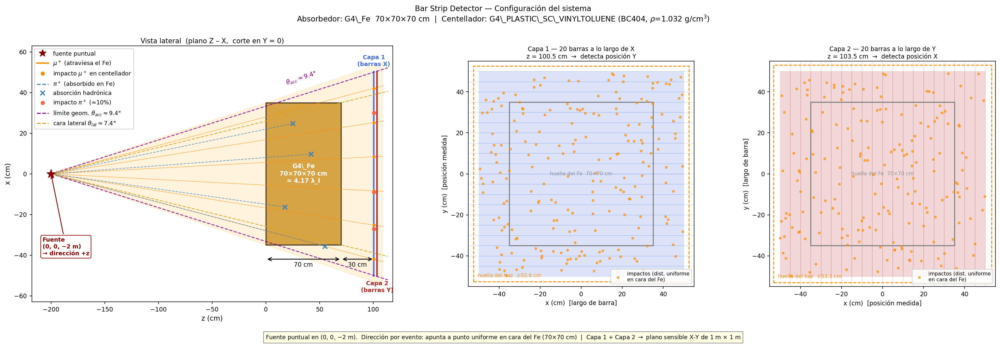
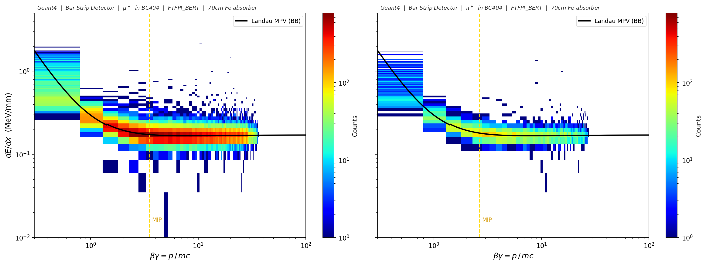
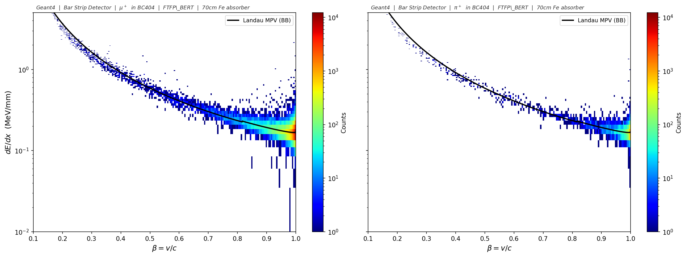
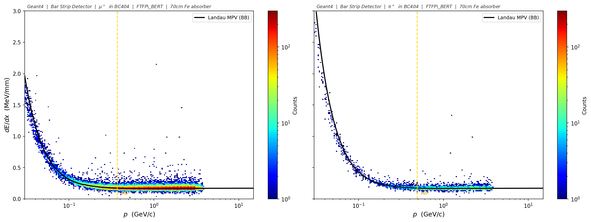
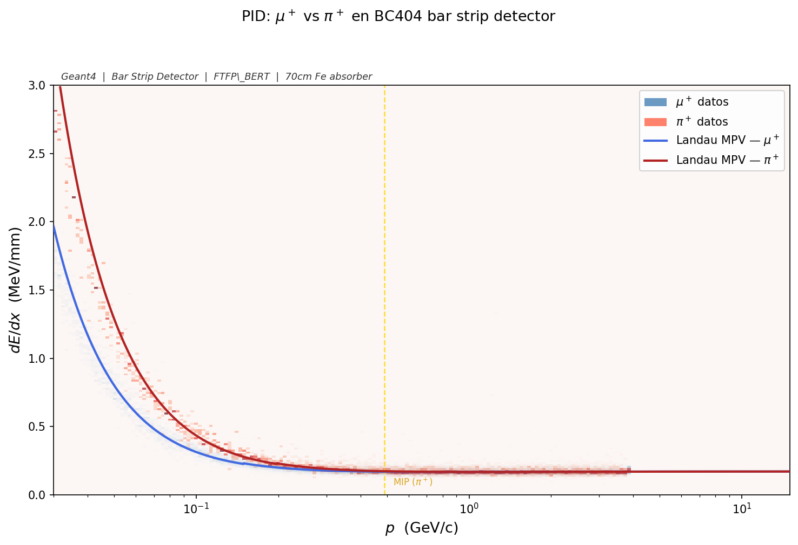
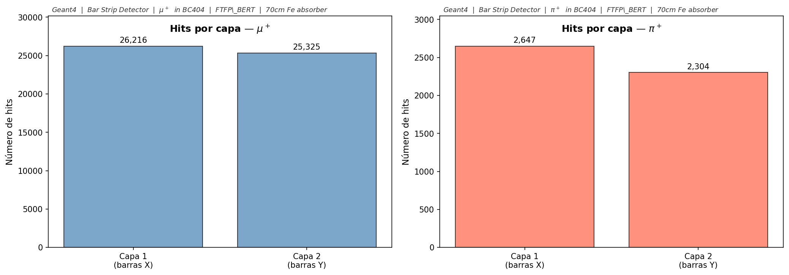
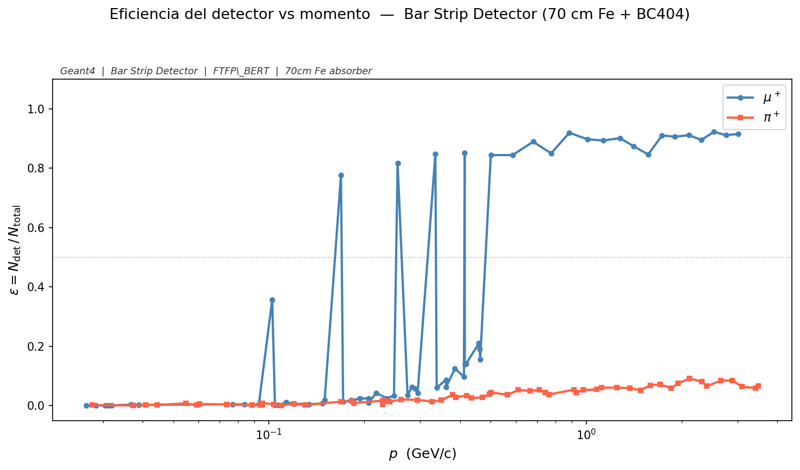
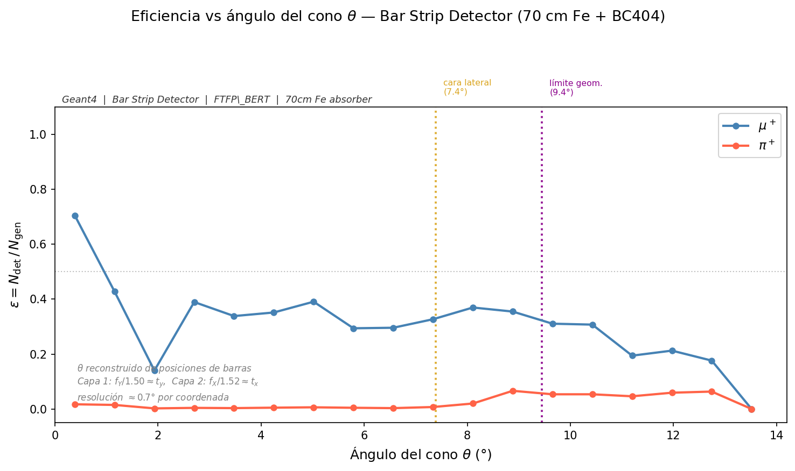

<details open>
<summary>🇪🇸 Versión en español</summary>

# Bar Strip Detector — haz mixto μ⁺/π⁺

Simulación Geant4 de un haz mixto μ⁺/π⁺ que atraviesa un absorbedor grueso de hierro y dos capas de barras de centellador plástico. El objetivo es separar muones de piones usando dE/dx, tiempo de vuelo, multiplicidad de hits y posición en las barras, sin necesidad de calorimetría.

---

## Distribución del sistema

```
[fuente cónica, z = −2 m]  →→→  [Fe 70×70×70 cm]  →→→  [vacío 30 cm]  →→→  [Capa 1]  [Capa 2]
                                  z = 0–70 cm                              z = 100.5 cm  z = 103.5 cm
```



*Vista lateral (izquierda): partículas desde un punto único en z = −2 m formando un cono que cubre la cara del Fe (70×70 cm). Trazas naranjas = muones que atraviesan el hierro; trazas azules discontinuas = piones absorbidos. Los paneles central y derecho muestran cada capa por separado: Capa 1 mide posición en Y, Capa 2 en X.*

### Mundo

Vacío (G4_Galactic), 4 m × 4 m × 6 m.

### Absorbedor de hierro

Cubo de G4_Fe, 70 × 70 × 70 cm, centrado en z = 35 cm.

- 70 cm de Fe = 4.17 longitudes de interacción nuclear (λ_I = 16.77 cm). Probabilidad de que un pión pase sin interacción hadrónica: exp(−4.17) ≈ 1.5%.
- El rango de un muón de 500 MeV/c en Fe es ≈ 50 cm; a 700 MeV/c supera los 70 cm y atraviesa. Ahí sube bruscamente la eficiencia de detección de muones.

### Detector activo — 2 capas de BC404

| Parámetro | Valor |
|---|---|
| Material | G4_PLASTIC_SC_VINYLTOLUENE (BC404, ρ = 1.032 g/cm³) |
| Dimensiones de cada barra | 1 m largo × 5 cm ancho × 1 cm grosor |
| Barras por capa | 20 |
| Cobertura transversal | 1 m × 1 m |
| Capa 1 | Barras a lo largo de X, posicionadas en Y, z = 100.5 cm |
| Capa 2 | Barras a lo largo de Y, posicionadas en X, z = 103.5 cm |
| Separación entre centros (Capa 1 → Capa 2) | 3 cm |
| Gap libre entre superficies | 2 cm (Capa 1 termina en z = 101 cm; Capa 2 empieza en z = 103 cm) |

Los centros de barra van de −47.5 cm a +47.5 cm en pasos de 5 cm. No hay gaps entre barras dentro de una misma capa.

---

## Definición de un hit

Un evento se considera detectado cuando la partícula primaria (TrackID = 1) cumple esta secuencia:

1. Atraviesa el bloque de hierro sin ser absorbida
2. Entra en una barra de Capa 1 y deposita energía (dE/dx registrado)
3. Sale de Capa 1 y recorre los 2 cm de gap libre entre capas (distancia entre superficies; la distancia centro a centro es 3 cm)
4. Entra en una barra de Capa 2 y deposita energía (dE/dx registrado)
5. Sale del otro lado del centellador

Cada paso de la partícula primaria dentro de cualquier barra activa genera una entrada en el NTuple. Eventos donde la partícula llega sólo a una capa también quedan registrados, filtrables por `layerID`.

### Energía depositada vs. momento del haz

El barrido en momento define el impulso de lanzamiento. El centellador mide dE/dx (energía por unidad de longitud), que depende de β según Bethe-Bloch. A mayor momento (partícula más rápida), menor dE/dx.

- `fEdep`: energía depositada en el paso → MeV
- `fdEdx`: energía por unidad de longitud → MeV/mm = fEdep / longitud del paso

---

## Archivos fuente

Todos en `simulation_mixed/`.

| Archivo | Qué define |
|---|---|
| `construction.cc / .hh` | Geometría completa: mundo, absorbedor de Fe, posicionamiento de las 40 barras en 2 capas |
| `detector.cc / .hh` | Detector sensible: registra cada paso de la partícula primaria y llena el NTuple |
| `generator.cc / .hh` | Fuente puntual en (0, 0, −2 m), selección 50/50 μ⁺/π⁺ por evento, dirección cónica |
| `physics.cc / .hh` | Lista de física: G4EmStandardPhysics + FTFP_BERT + G4OpticalPhysics |
| `run.cc / .hh` | Apertura del archivo ROOT por run, declaración de las 15 columnas del NTuple, ruta de salida |
| `action.cc / .hh` | Inicialización de acciones (conecta generator, run y detector) |
| `sim.cc` | `main()` — inicializa Geant4 y registra los managers |
| `barrido_continuo.mac` | Macro de Geant4: 80 runs en escala log de 50 MeV/c a 10 GeV/c, 2000 eventos por run |

---

## Fuente de partículas — haz cónico

La fuente es un punto único en (0, 0, −2 m). En cada evento se selecciona μ⁺ o π⁺ con probabilidad 50/50, y la dirección apunta a un punto objetivo uniforme en la cara frontal del Fe (±35 cm en X e Y). El ángulo del cono θ varía de 0° (incidencia central) a ≈ 13.9° (esquinas de la cara).

```cpp
G4double tx = (G4UniformRand() - 0.5) * 70.*cm;
G4double ty = (G4UniformRand() - 0.5) * 70.*cm;
G4ThreeVector source(0., 0., -2.*m);
G4ThreeVector target(tx, ty, 0.);
G4ParticleDefinition *particle = (G4UniformRand() < 0.5) ? fMuon : fPion;
fParticleGun->SetParticleDefinition(particle);
fParticleGun->SetParticleMomentumDirection((target - source).unit());
```

---

## Barrido en momento

80 runs en escala logarítmica de 50 MeV/c a 10 GeV/c, 2000 eventos por run (≈ 1000 μ⁺ + 1000 π⁺ por punto de momento). Total: 160 000 eventos.

`/gun/momentumAmp` fija el módulo del momento. Geant4 combina esa magnitud con la dirección calculada en `GeneratePrimaries()` para cada evento.

---

## Columnas del NTuple `Hits`

| Col | Nombre | Tipo | Descripción | Unidades |
|---|---|---|---|---|
| 0 | fX | double | Centro en X de la barra con hit | mm |
| 1 | fY | double | Centro en Y de la barra con hit | mm |
| 2 | fZ | double | Posición Z de la barra | mm |
| 3 | fEdep | double | Energía depositada en el paso | MeV |
| 4 | fdEdx | double | fEdep / longitud del paso | MeV/mm |
| 5 | Ekin | double | Energía cinética al inicio del paso | MeV |
| 6 | TOF | double | Tiempo de vuelo global | ns |
| 7 | TrackLength | double | Longitud acumulada de traza | mm |
| 8 | ScatteringAng | double | Ángulo entre dirección pre/post step | rad |
| 9 | Momentum | double | Módulo del momento al inicio del paso | MeV/c |
| 10 | fEvent | int | ID del evento (0–1999) | — |
| 11 | layerID | int | 0 = Capa 1, 1 = Capa 2 | — |
| 12 | barID | int | Número de barra dentro de la capa (0–19) | — |
| 13 | particleID | int | 0 = μ⁺, 1 = π⁺ | — |
| 14 | ConeAngle | double | Ángulo inicial entre la dirección del disparo y el eje z del haz | rad |

---

## Compilación y ejecución

```bash
# Crear directorio de salida (una sola vez)
mkdir -p "../../../Classifier/data/mixed"

# Compilar
cd simulation_mixed/build
cmake ..
make -j4

# Correr el barrido completo
./sim ../barrido_continuo.mac
```

Los 80 archivos ROOT se guardan en `Classifier/data/mixed/output_run0.root` … `output_run79.root`.

---

## Resultados

### Configuración del detector


El diagrama muestra la geometría completa: fuente puntual en z = −2 m, cono de partículas hacia la cara del Fe (70×70 cm), absorbedor, gap de 30 cm y las dos capas de centellador. Las líneas moradas discontinuas en la vista lateral delimitan el ángulo de aceptancia geométrica (θ_acc ≈ 9.4°): partículas por encima de ese ángulo llegan más allá de las barras (±50 cm) y no se detectan. En los paneles de cada capa, el rectángulo naranja discontinuo muestra la huella proyectada del haz (±52.6 cm), que supera ligeramente la cobertura del array de barras (±50 cm).

---

### dE/dx vs βγ



Histograma 2D de dE/dx en función de βγ = p/mc. Ambas especies siguen la curva de Bethe-Bloch teórica (Landau MPV, línea negra). El mínimo ionizante (MIP) aparece alrededor de βγ ≈ 3.5 (≈ 0.17 MeV/mm en BC404). Los π⁺ tienen menos estadística porque ~90% se absorben en el hierro antes de llegar al centellador.

---

### dE/dx vs β



La misma información expresada en términos de velocidad β = v/c. El flanco izquierdo de alta ionización corresponde a partículas lentas (β < 0.5). La curva de Landau MPV teórica coincide bien con la mediana experimental en todo el rango.

---

### dE/dx vs momento



dE/dx vs momento en GeV/c (escala log en X). A p < 200 MeV/c μ⁺ y π⁺ se separan porque su diferente masa produce distintas velocidades β al mismo momento. A partir de ~1 GeV/c ambas convergen al plateau MIP.

---

### Distribución de Landau


Distribución de dE/dx por paso en las barras de 1 cm de grosor. La cola asimétrica hacia la derecha es la distribución de Landau, característica de la pérdida de energía en capas delgadas. La cola larga corresponde a electrones delta (δ-rays) que se escapan del volumen activo llevándose parte de la energía.

---

### Overlay con banda IQR


Mediana de dE/dx vs βγ con banda intercuartílica (percentiles 25–75) para ambas especies. Ambas siguen la misma curva teórica de Landau MPV (línea negra). La banda más estrecha de π⁺ a alto βγ refleja su menor estadística (pocos piones llegan al centellador).

---

### PID combinado μ⁺ vs π⁺



μ⁺ y π⁺ superpuestos en el plano dE/dx vs p. La señal azul (μ⁺) es mucho más densa que la roja (π⁺) — la absorción hadrónica reduce los piones detectables a ~10% del total. Las curvas de Landau MPV teórica (líneas sólidas) coinciden con las medianas observadas.

---

### Hits por capa



Número de hits en Capa 1 vs Capa 2 para cada especie. Los μ⁺ muestran ~2% de asimetría entre capas (esperable para trazas casi rectas). Los π⁺ muestran ~12% de asimetría: algunos piones se dispersan hadrónicamene entre capas o pierden suficiente energía en el gap de 2 cm como para no llegar a Capa 2.

---

### Eficiencia de detección vs momento



**μ⁺:** ε sube de 0 a ≈ 87–90% entre 500–700 MeV/c. Ese rango corresponde al umbral de rango en 70 cm de hierro; por debajo, el muón se detiene antes de salir del absorbedor.

**π⁺:** ε se mantiene plana entre 5–10% en todo el rango de momenta. La probabilidad de supervivencia hadrónica (exp(−4.17) ≈ 1.5% pura) no depende del momento; el ~10% observado es mayor porque incluye piones que sufrieron dispersión hadrónica elástica y continuaron como traza primaria (TrackID = 1).

---

### Eficiencia vs ángulo del cono



ε en función del ángulo del cono θ, reconstruido de las posiciones centrales de las barras tocadas. El paso de barra de 5 cm limita la resolución angular a ~0.7° por coordenada; de ahí que el plot muestre ~14 puntos discretos y no una curva. Ángulo máximo del cono: arctan(35√2 cm / 200 cm) ≈ 13.9°.

El camino dentro del cubo de Fe (70×70×70 cm) depende de por qué cara salga la partícula:

- θ < 7.4°: sale por la cara trasera, recorre 70/cosθ cm — apenas más que en incidencia normal.
- 7.4° < θ < 9.4°: sale por una cara lateral. El camino cae rápido: solo ~34 cm a θ ≈ 8.5°. Más oblicua no es más hierro.
- θ > 9.4°: la partícula llega a |x| o |y| > 50 cm, fuera del alcance de las barras. La eficiencia se va a cero por aceptancia geométrica, no por blindaje adicional.

μ⁺: ε plana hasta ~9°, luego corte abrupto donde acaba la cobertura del centellador.
π⁺: el mismo corte geométrico a ~9°; el nivel base del ~10% lo pone la absorción hadrónica, sin dependencia angular.

---

## Gráficas con `plot_bethe_bloch.py`

```bash
cd "Bar Strip Detector"
python plot_bethe_bloch.py \
    --mixed "../Classifier/data/mixed/output_run*.root" \
    --out   img/
```

Genera 9 plots en `img/`. Para el ángulo del cono con mayor precisión, recompila y re-corre la simulación con la columna `ConeAngle` (columna 14, ya añadida a `detector.cc` y `run.cc`).

---

## Diferencias respecto a `Pion and muon simulation`

| Aspecto | Pion and muon simulation | Bar Strip Detector |
|---|---|---|
| Absorbedor | Fe 5×5×5 cm (0.30 λ_I) | Fe 70×70×70 cm (4.17 λ_I) |
| Detector | Placa BC404 10×10 m × 10 cm | 2 capas × 20 barras, 1 m × 5 cm × 1 cm |
| Fuente | Haz paralelo, posición aleatoria en cara Fe | Punto fijo (0,0,−2m), dirección aleatoria hacia cara Fe |
| Partículas | Simulaciones separadas μ⁺ y π⁺ | Mezcla 50/50 en una sola simulación |
| Columnas extra | — | `particleID` (0=μ⁺, 1=π⁺), `ConeAngle` (rad) |
| Info posición | Centro constante | barID → posición real de impacto |
| Eficiencia π⁺ plateau | ~75% (mayoría pasan) | ~10% (mayoría absorbidos) |

---

## Dependencias

```bash
pip install numpy matplotlib uproot
```

</details>

---

<details>
<summary>🇬🇧 English version</summary>

# Bar Strip Detector — mixed μ⁺/π⁺ beam

Geant4 simulation of a mixed μ⁺/π⁺ beam passing through a thick iron absorber and two plastic scintillator bar layers. Goal: separate muons from pions using dE/dx, time of flight, hit multiplicity, and bar position — no calorimetry needed.

---

## System layout

```
[cone source, z = −2 m]  →→→  [Fe 70×70×70 cm]  →→→  [30 cm vacuum]  →→→  [Layer 1]  [Layer 2]
                                z = 0–70 cm                               z = 100.5 cm  z = 103.5 cm
```


*Side view (left): particles from a point source at z = −2 m form a cone covering the Fe face (70×70 cm). Orange = muons that traverse the iron; blue dashed = pions absorbed in iron. Centre and right panels show each layer separately: Layer 1 measures Y position, Layer 2 measures X.*

### World volume

Vacuum (G4_Galactic), 4 m × 4 m × 6 m.

### Iron absorber

G4_Fe cube, 70 × 70 × 70 cm, centered at z = 35 cm.

- 70 cm Fe = 4.17 nuclear interaction lengths (λ_I = 16.77 cm). Probability of a pion passing without hadronic interaction: exp(−4.17) ≈ 1.5%.
- A 500 MeV/c muon has range ≈ 50 cm in Fe; at 700 MeV/c it exceeds 70 cm and punches through. That is where muon detection efficiency rises sharply.

### Active detector — 2 BC404 bar layers

| Parameter | Value |
|---|---|
| Material | G4_PLASTIC_SC_VINYLTOLUENE (BC404, ρ = 1.032 g/cm³) |
| Bar dimensions | 1 m long × 5 cm wide × 1 cm thick |
| Bars per layer | 20 |
| Transverse coverage | 1 m × 1 m |
| Layer 1 | Bars along X, displaced in Y, z = 100.5 cm |
| Layer 2 | Bars along Y, displaced in X, z = 103.5 cm |
| Centre-to-centre separation (L1 → L2) | 3 cm |
| Free gap between surfaces | 2 cm (Layer 1 ends at z = 101 cm; Layer 2 starts at z = 103 cm) |

Bar centres from −47.5 cm to +47.5 cm in 5 cm steps. No gaps between bars within a layer.

---

## Hit definition

An event is considered detected when the primary particle (TrackID = 1) follows this sequence:

1. Traverses the iron block without being absorbed
2. Enters a Layer 1 bar and deposits energy (dE/dx recorded)
3. Exits Layer 1 and crosses the 2 cm free gap between layers (centre-to-centre is 3 cm)
4. Enters a Layer 2 bar and deposits energy (dE/dx recorded)
5. Exits the far side of the scintillator

Every step of the primary particle inside any active bar creates one NTuple entry. Events that only reach one layer are also recorded and can be filtered with `layerID`.

### Deposited energy vs. beam momentum

The momentum sweep controls the launch momentum. The scintillator measures dE/dx (energy per unit length), which depends on β via Bethe-Bloch. Higher momentum = faster particle = lower dE/dx.

- `fEdep`: energy deposited in the step → MeV
- `fdEdx`: energy per unit length → MeV/mm = fEdep / step length

---

## Source files

All in `simulation_mixed/`.

| File | What it defines |
|---|---|
| `construction.cc / .hh` | Full geometry: world, Fe absorber, placement of all 40 bars in 2 layers |
| `detector.cc / .hh` | Sensitive detector: records each step of the primary particle and fills the NTuple |
| `generator.cc / .hh` | Point source at (0, 0, −2 m), 50/50 μ⁺/π⁺ per event, cone direction |
| `physics.cc / .hh` | Physics list: G4EmStandardPhysics + FTFP_BERT + G4OpticalPhysics |
| `run.cc / .hh` | ROOT file per run, 15-column NTuple declaration, output path |
| `action.cc / .hh` | Action initialization (connects generator, run and detector) |
| `sim.cc` | `main()` — initialises Geant4 and registers the managers |
| `barrido_continuo.mac` | Geant4 macro: 80 runs on a log scale from 50 MeV/c to 10 GeV/c, 2000 events per run |

---

## Particle source — cone beam

The source is a single point at (0, 0, −2 m). Each event selects μ⁺ or π⁺ with 50/50 probability, and the direction points to a uniformly random target on the Fe front face (±35 cm in X and Y). The cone angle θ ranges from 0° (on-axis) to ≈ 13.9° (corners).

```cpp
G4double tx = (G4UniformRand() - 0.5) * 70.*cm;
G4double ty = (G4UniformRand() - 0.5) * 70.*cm;
G4ThreeVector source(0., 0., -2.*m);
G4ThreeVector target(tx, ty, 0.);
G4ParticleDefinition *particle = (G4UniformRand() < 0.5) ? fMuon : fPion;
fParticleGun->SetParticleDefinition(particle);
fParticleGun->SetParticleMomentumDirection((target - source).unit());
```

---

## Momentum sweep

80 runs on a log scale from 50 MeV/c to 10 GeV/c, 2000 events per run (≈ 1000 μ⁺ + 1000 π⁺ per momentum point). Total: 160 000 events.

`/gun/momentumAmp` sets the momentum magnitude. Geant4 combines it with the per-event direction from `GeneratePrimaries()`.

---

## NTuple `Hits` columns

| Col | Name | Type | Description | Units |
|---|---|---|---|---|
| 0 | fX | double | X centre of the bar with the hit | mm |
| 1 | fY | double | Y centre of the bar with the hit | mm |
| 2 | fZ | double | Z position of the bar | mm |
| 3 | fEdep | double | Energy deposited in the step | MeV |
| 4 | fdEdx | double | fEdep / step length | MeV/mm |
| 5 | Ekin | double | Kinetic energy at step start | MeV |
| 6 | TOF | double | Global time of flight | ns |
| 7 | TrackLength | double | Cumulative track length | mm |
| 8 | ScatteringAng | double | Angle between pre/post step directions | rad |
| 9 | Momentum | double | Momentum magnitude at step start | MeV/c |
| 10 | fEvent | int | Event ID (0–1999) | — |
| 11 | layerID | int | 0 = Layer 1, 1 = Layer 2 | — |
| 12 | barID | int | Bar number within the layer (0–19) | — |
| 13 | particleID | int | 0 = μ⁺, 1 = π⁺ | — |
| 14 | ConeAngle | double | Initial angle between particle direction and beam axis z | rad |

---

## Build and run

```bash
# Create output directory (once)
mkdir -p "../../../Classifier/data/mixed"

# Build
cd simulation_mixed/build
cmake ..
make -j4

# Run the full sweep
./sim ../barrido_continuo.mac
```

The 80 ROOT files are written to `Classifier/data/mixed/output_run0.root` … `output_run79.root`.

---

## Results

### Detector configuration


The diagram shows the full geometry: point source at z = −2 m, cone toward the Fe face (70×70 cm), absorber, 30 cm gap, and the two scintillator layers. The purple dashed lines in the side view mark the geometric acceptance limit (θ_acc ≈ 9.4°): particles above that angle arrive beyond the bar array (±50 cm) and are not detected. In each layer panel, the orange dashed rectangle shows the projected beam footprint (±52.6 cm), which slightly overflows the bar coverage (±50 cm).

---

### dE/dx vs βγ


2D histogram of dE/dx as a function of βγ = p/mc. Both species follow the theoretical Bethe-Bloch curve (Landau MPV, black line). The minimum ionising particle (MIP) appears around βγ ≈ 3.5 (≈ 0.17 MeV/mm in BC404). π⁺ statistics are sparse because ~90% are absorbed in iron before reaching the scintillator.

---

### dE/dx vs β


Same information expressed in terms of velocity β = v/c. The high-ionisation left edge corresponds to slow particles (β < 0.5). The theoretical Landau MPV curve matches the experimental median well across the full range.

---

### dE/dx vs momentum


dE/dx vs momentum in GeV/c (log X axis). Below p ≈ 200 MeV/c, μ⁺ and π⁺ separate because their different masses produce different β at the same momentum. Above ~1 GeV/c both converge to the MIP plateau.

---

### Landau distribution


dE/dx distribution per step in the 1 cm thick bars. The asymmetric right tail is the Landau distribution, typical of energy loss in thin layers. The long tail comes from high-energy delta electrons (δ-rays) that escape the active volume carrying part of the energy.

---

### Overlay with IQR band


Median dE/dx vs βγ with the interquartile range (25th–75th percentile) for both species. Both track the same theoretical Landau MPV curve (black dashed). The narrower π⁺ band at high βγ reflects the smaller sample.

---

### Combined PID μ⁺ vs π⁺


μ⁺ and π⁺ overlaid in the dE/dx vs p plane. The blue signal (μ⁺) is far denser than the red (π⁺) — hadronic absorption reduces the detectable pion fraction to ~10%. The theoretical Landau MPV curves (solid lines) match the observed medians.

---

### Hits per layer


Hit count in Layer 1 vs Layer 2 for each species. μ⁺ show ~2% asymmetry between layers (expected for nearly straight tracks). π⁺ show ~12%: some pions scatter hadronically between layers or lose enough energy in the 2 cm gap to stop before Layer 2.

---

### Detection efficiency vs momentum


**μ⁺:** ε rises from 0 to ≈ 87–90% between 500–700 MeV/c. That momentum range corresponds to the range threshold in 70 cm of iron — below it, the muon stops inside the absorber.

**π⁺:** ε stays flat at 5–10% across all momenta. The hadronic survival probability (exp(−4.17) ≈ 1.5% pure, observed ≈ 10% due to elastic hadronic scattering preserving TrackID = 1) does not depend appreciably on momentum.

---

### Efficiency vs cone angle


ε as a function of cone angle θ, reconstructed from hit bar center positions. The 5 cm bar pitch gives ~0.7° angular resolution per coordinate, which is why the plot shows ~14 discrete points rather than a continuous curve. Maximum cone angle: arctan(35√2 cm / 200 cm) ≈ 13.9°.

The path through the Fe cube (70×70×70 cm) depends on which face the particle exits from:

- θ < 7.4°: back face exit, path = 70/cosθ cm — barely longer than straight through.
- 7.4° < θ < 9.4°: lateral face exit, path drops fast — only ~34 cm at θ ≈ 8.5°. More oblique is not more iron.
- θ > 9.4°: particle arrives at |x| or |y| > 50 cm, past the bar coverage. Efficiency collapses from geometric acceptance loss, not extra shielding.

μ⁺: ε flat up to ~9°, then a sharp cutoff where the scintillator coverage ends.
π⁺: same geometric cutoff at ~9°; the ~10% floor is set by hadronic absorption, which has no angular dependence.

---

## Running the plot script

```bash
cd "Bar Strip Detector"
python plot_bethe_bloch.py \
    --mixed "../Classifier/data/mixed/output_run*.root" \
    --out   img/
```

Generates 9 plots in `img/`. For more accurate cone angles, recompile and re-run the simulation with the `ConeAngle` column (column 14, already added to `detector.cc` and `run.cc`).

---

## Differences vs `Pion and muon simulation`

| Aspect | Pion and muon simulation | Bar Strip Detector |
|---|---|---|
| Absorber | Fe 5×5×5 cm (0.30 λ_I) | Fe 70×70×70 cm (4.17 λ_I) |
| Detector | BC404 plate 10×10 m × 10 cm | 2 layers × 20 bars, 1 m × 5 cm × 1 cm |
| Source | Parallel beam, random position on Fe face | Fixed point (0,0,−2m), random direction toward Fe face |
| Particles | Separate μ⁺ and π⁺ simulations | 50/50 mix in one simulation |
| Extra columns | — | `particleID` (0=μ⁺, 1=π⁺), `ConeAngle` (rad) |
| Position info | Constant centre | barID → actual hit position |
| π⁺ plateau efficiency | ~75% (most pass) | ~10% (most absorbed) |

---

## Dependencies

```bash
pip install numpy matplotlib uproot
```

</details>
