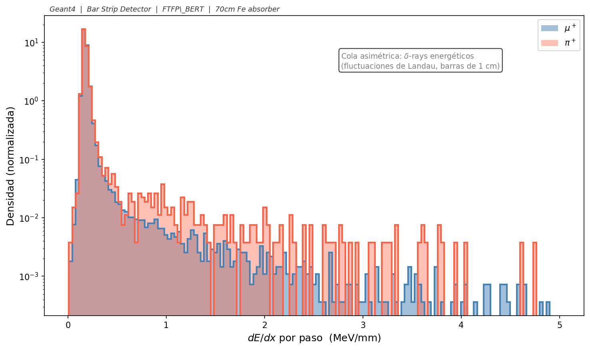
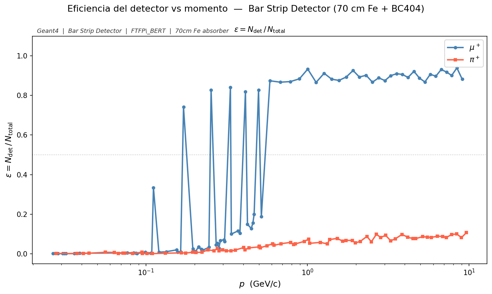

# Bar Strip Detector — μ⁺/π⁺ mixed beam

Geant4 simulation of a mixed μ⁺/π⁺ beam passing through a thick iron absorber and two layers of plastic scintillator bars. The goal is separating muons from pions using dE/dx, time of flight, hit multiplicity, and detector geometry — enough features to feed a classifier without needing calorimetry.

---

## How the system is laid out

```
[fuente cónica, z = −2 m]  →→→  [Fe 70×70×70 cm]  →→→  [vacío 30 cm]  →→→  [Capa 1]  [Capa 2]
                                  z = 0–70 cm                              z = 100.5 cm  z = 103.5 cm
```


*Vista lateral (izquierda): las partículas salen de un punto único en z = −2 m formando un cono que cubre exactamente la cara frontal del absorbedor de Fe (70×70 cm). Las trazas naranjas son muones que atraviesan el hierro y llegan a ambas capas de BC404; las trazas azules discontinuas son piones que se absorben hadrónicamene dentro del Fe. Las cruces marcan el punto de absorción. Los paneles central y derecho muestran cada capa por separado: Capa 1 mide posición en Y (barras a lo largo de X), Capa 2 mide posición en X (barras a lo largo de Y). Los puntos naranjas indican la distribución uniforme de impactos dentro del área proyectada del Fe.*

### Mundo

Vacío (G4_Galactic), 4 m × 4 m × 6 m.

### Absorbedor de hierro

Cubo de G4_Fe, 70 × 70 × 70 cm, centrado en z = 35 cm.

- 70 cm de Fe ≡ **4.17 longitudes de interacción nuclear** (λ_I = 16.77 cm). La probabilidad de que un pión pase sin interacción hadrónica es exp(−4.17) ≈ 1.5%.
- El rango de un muón de 500 MeV/c en Fe es ≈ 50 cm; a 700 MeV/c ya supera los 70 cm y atraviesa. Por eso la eficiencia de detección de muones sube bruscamente en esa zona.

### Detector activo — 2 capas de BC404

| Parámetro | Valor |
|---|---|
| Material | G4_PLASTIC_SC_VINYLTOLUENE (BC404, ρ = 1.032 g/cm³) |
| Dimensiones de cada barra | 1 m largo × 5 cm ancho × 1 cm grosor |
| Barras por capa | 20 |
| Cobertura transversal | 1 m × 1 m |
| Capa 1 | Barras a lo largo de X, posicionadas en Y, z = 100.5 cm |
| Capa 2 | Barras a lo largo de Y, posicionadas en X, z = 103.5 cm |
| Separación entre centros | 3 cm |

Los centros de barra van de −47.5 cm a +47.5 cm en pasos de 5 cm. No hay gaps entre barras.

---

## Definición de un hit

Un evento se considera detectado cuando la partícula primaria (TrackID = 1) cumple la siguiente secuencia:

1. Atraviesa el bloque de hierro sin ser absorbida
2. Entra en una barra de **Capa 1** y deposita energía (dE/dx registrado)
3. Sale de Capa 1 y recorre los 3 cm de gap entre capas
4. Entra en una barra de **Capa 2** y deposita energía (dE/dx registrado)
5. Sale del otro lado del centellador

Cada paso de la partícula primaria dentro de cualquier barra activa genera una entrada en el NTuple. Eventos donde la partícula sólo llega a una capa (por ejemplo, porque se detiene entre capas) también quedan registrados, pero se pueden filtrar en análisis posterior usando `layerID`.

### Energía depositada vs. momento del beam

Estos son dos cantidades distintas. El barrido en momento define con qué impulso se lanza cada partícula — es la variable de control del experimento. Lo que el centellador mide es **dE/dx** (energía depositada por unidad de longitud de traza), que depende de la velocidad β de la partícula según la fórmula de Bethe-Bloch. A mayor momento (partícula más rápida), menor dE/dx porque la partícula pasa más rápido y tiene menos tiempo para transferir energía al material. Las unidades son:

- `fEdep`: energía total depositada en el paso → **MeV**
- `fdEdx`: energía por unidad de longitud → **MeV/mm** = fEdep / longitud del paso

---

## Fuente de partículas — haz cónico

La fuente es un **punto único** en (0, 0, −2 m). En cada evento se selecciona aleatoriamente μ⁺ o π⁺ con probabilidad 50/50, y la dirección del disparo se calcula apuntando a un punto objetivo uniforme en la cara frontal del Fe (±35 cm en X e Y). Esto forma un cono natural que ilumina uniformemente toda la cara del absorbedor.

```cpp
// En GeneratePrimaries() — por evento:
G4double tx = (G4UniformRand() - 0.5) * 70.*cm;   // objetivo en cara Fe
G4double ty = (G4UniformRand() - 0.5) * 70.*cm;
G4ThreeVector source(0., 0., -2.*m);
G4ThreeVector target(tx, ty, 0.);
G4ParticleDefinition *particle = (G4UniformRand() < 0.5) ? fMuon : fPion;
fParticleGun->SetParticleDefinition(particle);
fParticleGun->SetParticleMomentumDirection((target - source).unit());
```

---

## Barrido en momento

80 runs en escala logarítmica de 50 MeV/c a 10 GeV/c, 2000 eventos por run (≈ 1000 μ⁺ + 1000 π⁺ por punto de momento). Total: 160 000 eventos.

El comando `/gun/momentumAmp` fija el módulo de **momento** (no energía cinética). Geant4 combina esa magnitud con la dirección que calcula `GeneratePrimaries()` para cada evento.

---

## Columnas del NTuple `Hits`

| Columna | Nombre | Tipo | Descripción | Unidades |
|---|---|---|---|---|
| 0 | fX | double | Centro en X de la barra con hit | mm |
| 1 | fY | double | Centro en Y de la barra con hit | mm |
| 2 | fZ | double | Posición Z de la barra | mm |
| 3 | fEdep | double | Energía depositada en el paso | MeV |
| 4 | fdEdx | double | fEdep / longitud del paso | MeV/mm |
| 5 | Ekin | double | Energía cinética al inicio del paso | MeV |
| 6 | TOF | double | Tiempo de vuelo global | ns |
| 7 | TrackLength | double | Longitud acumulada de traza | mm |
| 8 | ScatteringAng | double | Ángulo entre dirección pre/post step | rad |
| 9 | Momentum | double | Módulo del momento al inicio del paso | MeV/c |
| 10 | fEvent | int | ID del evento (0–1999) | — |
| 11 | layerID | int | 0 = Capa 1, 1 = Capa 2 | — |
| 12 | barID | int | Número de barra dentro de la capa (0–19) | — |
| 13 | particleID | int | 0 = μ⁺, 1 = π⁺ | — |

---

## Compilación y ejecución

```bash
# Crear directorio de salida (una sola vez)
mkdir -p "../../../Classifier/data/mixed"

# Compilar
cd simulation_mixed/build
cmake ..
make -j4

# Correr el barrido completo
./sim ../barrido_continuo.mac
```

Los 80 archivos ROOT se guardan en `Classifier/data/mixed/output_run0.root` … `output_run79.root`.

---

## Resultados

### Configuración del detector


### Bethe-Bloch: dE/dx vs βγ


Los muones muestran la curva de Bethe-Bloch limpia con mínimo ionizante (MIP) alrededor de βγ ≈ 3–4. Los piones también siguen la curva teórica pero con menos estadística, porque la mayoría se absorben antes de llegar al centellador.

### dE/dx vs β


### dE/dx vs momento


### Overlay con banda IQR


### PID combinado μ⁺ vs π⁺


### Distribución de Landau



La distribución asimétrica con cola hacia la derecha es la distribución de Landau, característica de la pérdida de energía en capas delgadas (1 cm de BC404). La cola corresponde a electrones delta (δ-rays) de alta energía.

### Hits por capa


Se espera que los hits en Capa 1 y Capa 2 sean similares para muones (la partícula llega recta a ambas). Para piones que sí llegan, también se espera simetría. Diferencias grandes indican dispersión o absorción parcial entre capas.

### Eficiencia de detección vs momento



**μ⁺:** La eficiencia sube de 0 a ≈ 87–90% conforme el momento supera el umbral de penetración en 70 cm de Fe (≈ 500–700 MeV/c). A partir de ahí se estabiliza.

**π⁺:** Se mantiene en ε ≈ 5–12% en todo el rango. La fracción que pasa no está determinada por el momento sino por la probabilidad de supervivencia hadrónica: con 4.17 λ_I, el 98.5% de los piones interacciona inelásticamente. El ~10% observado (mayor que el ~1.5% teórico) incluye piones que sufrieron dispersión hadrónica elástica y continuaron como partícula primaria (TrackID = 1).

---

## Gráficas con `plot_bethe_bloch.py`

```bash
cd "Bar Strip Detector"
python plot_bethe_bloch.py \
    --mixed "../Classifier/data/mixed/output_run*.root" \
    --out   img/
```

Genera 8 plots en `img/`.

---

## Diferencias respecto a `Pion and muon simulation`

| Aspecto | Pion and muon simulation | Bar Strip Detector |
|---|---|---|
| Absorbedor | Fe 5×5×5 cm (0.30 λ_I) | Fe 70×70×70 cm (4.17 λ_I) |
| Detector | Placa BC404 10×10 m × 10 cm | 2 capas × 20 barras, 1 m × 5 cm × 1 cm |
| Fuente | Haz paralelo, posición aleatoria en cara Fe | Punto fijo (0,0,−2m), dirección aleatoria hacia cara Fe |
| Partículas | Simulaciones separadas μ⁺ y π⁺ | Mezcla 50/50 en una sola simulación |
| Columna extra | — | `particleID` (0=μ⁺, 1=π⁺) |
| Info posición | Centro constante | barID → posición real de impacto |
| Eficiencia π⁺ plateau | ~75% (mayoría pasan) | ~10% (mayoría absorbidos) |

---

## Dependencias

```bash
pip install numpy matplotlib uproot
```
