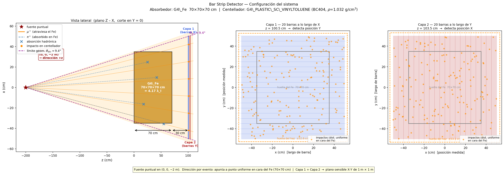
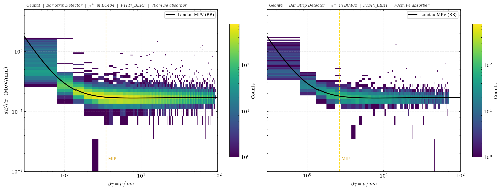
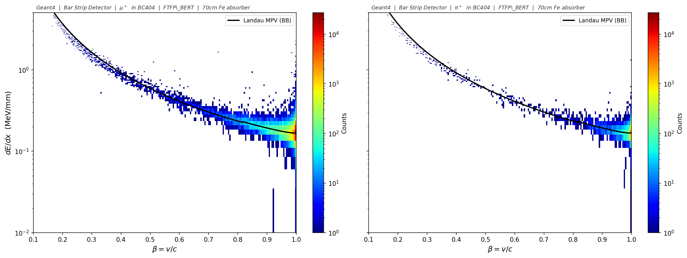
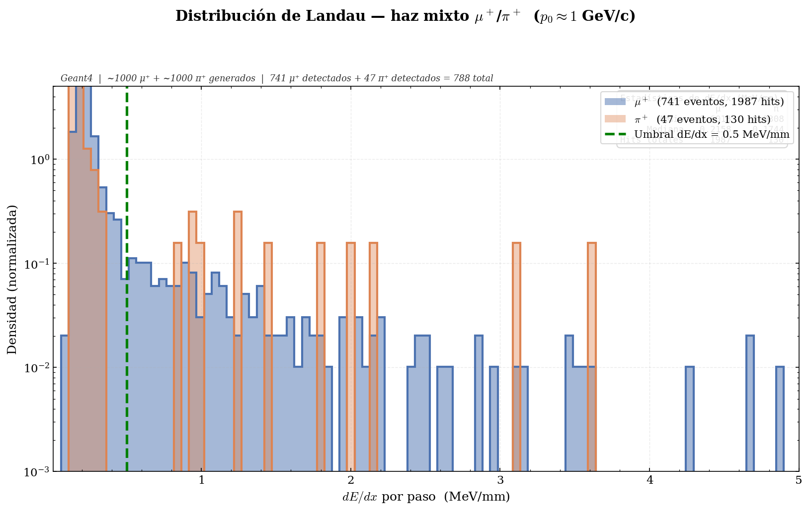
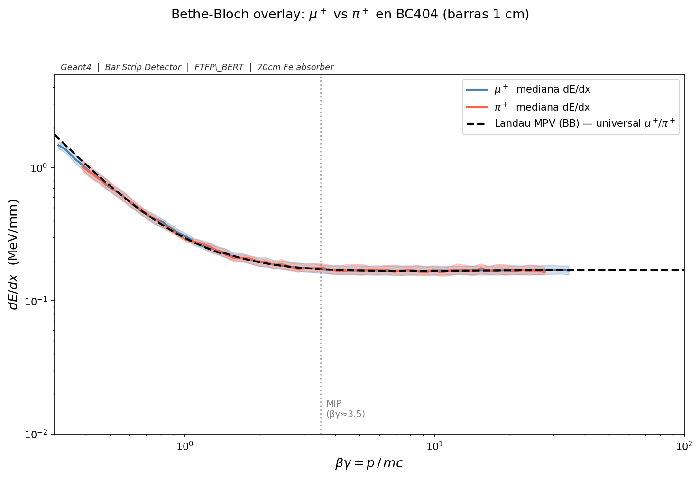
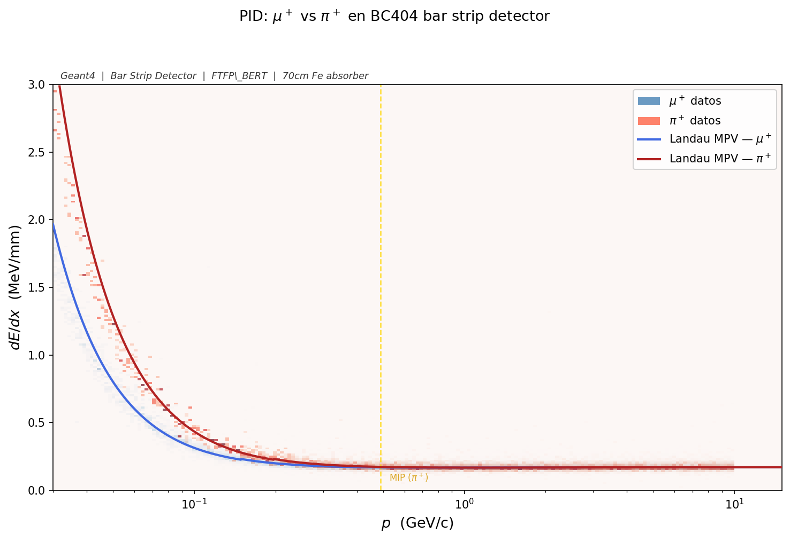
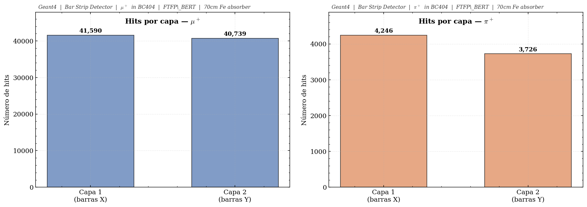
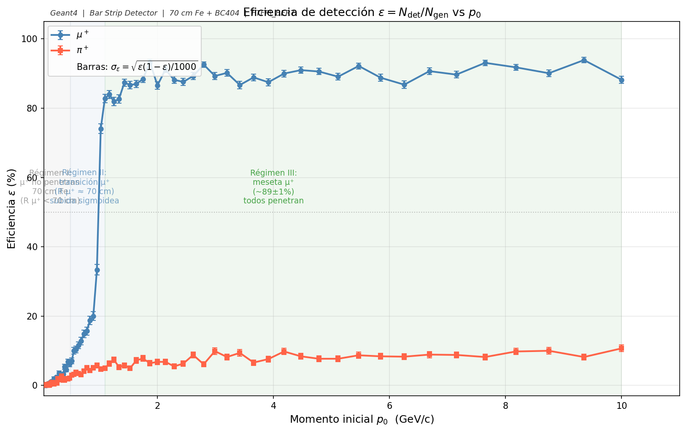
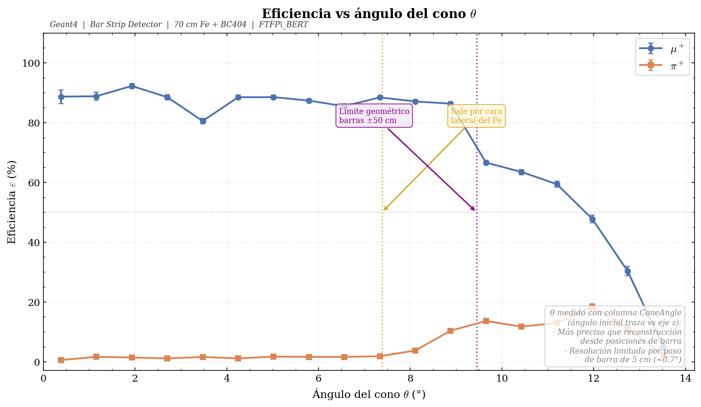

<div align="center">

[](#bar-strip-detector--haz-mixto-μπ)
[](#bar-strip-detector--mixed-μπ-beam)

[Geometría](#distribución-del-sistema) ·
[Fuente](#fuente-de-partículas--haz-cónico) ·
[NTuple](#columnas-del-ntuple-hits) ·
[Compilar](#compilación-y-ejecución) ·
[dE/dx](#dedx-vs-βγ) ·
[Eficiencia](#eficiencia-de-detección-vs-momento) ·
[Comparativa](#diferencias-respecto-a-pion-and-muon-simulation)

</div>

---

<details open>
<summary>🇪🇸 Versión en español</summary>

# Bar Strip Detector — haz mixto μ⁺/π⁺

Simulación Geant4 de un haz mixto μ⁺/π⁺ que atraviesa un bloque grueso de hierro y dos capas de barras centelladoras. La idea es separar muones de piones con dE/dx, tiempo de vuelo, multiplicidad de hits y posición en las barras, sin tirar de calorimetría.

---

## Distribución del sistema

```
[fuente cónica, z = −2 m]  →→→  [Fe 70×70×70 cm]  →→→  [vacío 30 cm]  →→→  [Capa 1]  [Capa 2]
                                  z = 0–70 cm                              z = 100.5 cm  z = 103.5 cm
```



*Vista lateral (izquierda): partículas desde un punto único en z = −2 m formando un cono que cubre la cara del Fe (70×70 cm). Trazas naranjas = muones que atraviesan el hierro; trazas azules discontinuas = piones absorbidos. Los paneles central y derecho muestran cada capa por separado: Capa 1 mide posición en Y, Capa 2 en X.*

### Mundo

Vacío (G4_Galactic), 4 m × 4 m × 6 m.

### Absorbedor de hierro

Cubo de G4_Fe, 70 × 70 × 70 cm, centrado en z = 35 cm.

- 70 cm de Fe = 4.17 longitudes de interacción nuclear (λ_I = 16.77 cm). Probabilidad de que un pión pase sin interacción hadrónica: exp(−4.17) ≈ 1.5%.
- El rango de un muón de 500 MeV/c en Fe es ≈ 50 cm; a 700 MeV/c supera los 70 cm y atraviesa. Ahí sube bruscamente la eficiencia de detección de muones.

### Detector activo — 2 capas de BC404

| Parámetro | Valor |
|---|---|
| Material | G4_PLASTIC_SC_VINYLTOLUENE (BC404, ρ = 1.032 g/cm³) |
| Dimensiones de cada barra | 1 m largo × 5 cm ancho × 1 cm grosor |
| Barras por capa | 20 |
| Cobertura transversal | 1 m × 1 m |
| Capa 1 | Barras a lo largo de X, posicionadas en Y, z = 100.5 cm |
| Capa 2 | Barras a lo largo de Y, posicionadas en X, z = 103.5 cm |
| Separación entre centros (Capa 1 → Capa 2) | 3 cm |
| Gap libre entre superficies | 2 cm (Capa 1 termina en z = 101 cm; Capa 2 empieza en z = 103 cm) |

Los centros de barra van de −47.5 cm a +47.5 cm en pasos de 5 cm. No hay gaps entre barras dentro de una misma capa.

---

## Definición de un hit

Un evento se considera detectado cuando la partícula primaria (TrackID = 1) cumple esta secuencia:

1. Atraviesa el bloque de hierro sin ser absorbida
2. Entra en una barra de Capa 1 y deposita energía (dE/dx registrado)
3. Sale de Capa 1 y recorre los 2 cm de gap libre entre capas (distancia entre superficies; la distancia centro a centro es 3 cm)
4. Entra en una barra de Capa 2 y deposita energía (dE/dx registrado)
5. Sale del otro lado del centellador

Cada paso de la partícula primaria dentro de cualquier barra activa genera una entrada en el NTuple. Eventos donde la partícula llega sólo a una capa también quedan registrados, filtrables por `layerID`.

### Energía depositada vs. momento del haz

El barrido en momento define el impulso de lanzamiento. El centellador mide dE/dx (energía por unidad de longitud), que depende de β según Bethe-Bloch. A mayor momento (partícula más rápida), menor dE/dx.

- `fEdep`: energía depositada en el paso → MeV
- `fdEdx`: energía por unidad de longitud → MeV/mm = fEdep / longitud del paso

---

## Archivos fuente

Todos en `simulation_mixed/`.

| Archivo | Qué define |
|---|---|
| `construction.cc / .hh` | Geometría completa: mundo, absorbedor de Fe, posicionamiento de las 40 barras en 2 capas |
| `detector.cc / .hh` | Detector sensible: registra cada paso de la partícula primaria y llena el NTuple |
| `generator.cc / .hh` | Fuente puntual en (0, 0, −2 m), selección 50/50 μ⁺/π⁺ por evento, dirección cónica |
| `physics.cc / .hh` | Lista de física: G4EmStandardPhysics + FTFP_BERT + G4OpticalPhysics |
| `run.cc / .hh` | Apertura del archivo ROOT por run, declaración de las 15 columnas del NTuple, ruta de salida |
| `action.cc / .hh` | Inicialización de acciones (conecta generator, run y detector) |
| `sim.cc` | `main()` — inicializa Geant4 y registra los managers |
| `barrido_continuo.mac` | Macro de Geant4: 80 runs en escala log de 50 MeV/c a 10 GeV/c, 2000 eventos por run |

---

## Fuente de partículas — haz cónico

La fuente es un punto único en (0, 0, −2 m). En cada evento se selecciona μ⁺ o π⁺ con probabilidad 50/50, y la dirección apunta a un punto objetivo uniforme en la cara frontal del Fe (±35 cm en X e Y). El ángulo del cono θ varía de 0° (incidencia central) a ≈ 13.9° (esquinas de la cara).

```cpp
G4double tx = (G4UniformRand() - 0.5) * 70.*cm;
G4double ty = (G4UniformRand() - 0.5) * 70.*cm;
G4ThreeVector source(0., 0., -2.*m);
G4ThreeVector target(tx, ty, 0.);
G4ParticleDefinition *particle = (G4UniformRand() < 0.5) ? fMuon : fPion;
fParticleGun->SetParticleDefinition(particle);
fParticleGun->SetParticleMomentumDirection((target - source).unit());
```

---

## Barrido en momento

80 runs en escala logarítmica de 50 MeV/c a 10 GeV/c, 2000 eventos por run (≈ 1000 μ⁺ + 1000 π⁺ por punto de momento). Total: 160 000 eventos.

`/gun/momentumAmp` fija el módulo del momento. Geant4 combina esa magnitud con la dirección calculada en `GeneratePrimaries()` para cada evento.

---

## Columnas del NTuple `Hits`

| Col | Nombre | Tipo | Descripción | Unidades |
|---|---|---|---|---|
| 0 | fX | double | Centro en X de la barra con hit | mm |
| 1 | fY | double | Centro en Y de la barra con hit | mm |
| 2 | fZ | double | Posición Z de la barra | mm |
| 3 | fEdep | double | Energía depositada en el paso | MeV |
| 4 | fdEdx | double | fEdep / longitud del paso | MeV/mm |
| 5 | Ekin | double | Energía cinética al inicio del paso | MeV |
| 6 | TOF | double | Tiempo de vuelo global | ns |
| 7 | TrackLength | double | Longitud acumulada de traza | mm |
| 8 | ScatteringAng | double | Ángulo entre dirección pre/post step | rad |
| 9 | Momentum | double | Módulo del momento al inicio del paso | MeV/c |
| 10 | fEvent | int | ID del evento (0–1999) | — |
| 11 | layerID | int | 0 = Capa 1, 1 = Capa 2 | — |
| 12 | barID | int | Número de barra dentro de la capa (0–19) | — |
| 13 | particleID | int | 0 = μ⁺, 1 = π⁺ | — |
| 14 | ConeAngle | double | Ángulo inicial entre la dirección del disparo y el eje z del haz | rad |

---

## Compilación y ejecución

```bash
# Crear directorio de salida (una sola vez)
mkdir -p "../../../Classifier/data/mixed"

# Compilar
cd simulation_mixed/build
cmake ..
make -j4

# Correr el barrido completo
./sim ../barrido_continuo.mac
```

Los 80 archivos ROOT se guardan en `Classifier/data/mixed/output_run0.root` … `output_run79.root`.

---

## Resultados

### Configuración del detector


El diagrama muestra toda la geometría: fuente puntual en z = −2 m, cono de partículas hacia la cara del Fe (70×70 cm), absorbedor, gap de 30 cm y las dos capas de centellador. Las líneas moradas discontinuas en la vista lateral marcan el límite de aceptancia geométrica (θ_acc ≈ 9.4°): por encima de ese ángulo las partículas caen fuera de las barras (±50 cm) y no se detectan. En cada panel de capa, el rectángulo naranja discontinuo es la huella proyectada del haz (±52.6 cm), que se pasa un poco de la cobertura del array (±50 cm).

---

### dE/dx vs βγ



Histograma 2D de dE/dx en función de βγ = p/mc. Las dos especies siguen la curva teórica de Bethe-Bloch (Landau MPV, línea negra). El mínimo ionizante (MIP) aparece en βγ ≈ 3.5, unos 0.17 MeV/mm en BC404. Los π⁺ tienen menos estadística: ~90 % se absorben en el hierro antes de llegar al centellador.

---

### dE/dx vs β



Lo mismo pero en función de la velocidad β = v/c. El flanco izquierdo de alta ionización son las partículas lentas (β < 0.5). La curva teórica de Landau MPV casa bien con la mediana experimental en todo el rango.

---

### dE/dx vs momento


dE/dx vs momento en GeV/c (escala log en X). Por debajo de p ≈ 200 MeV/c los μ⁺ y π⁺ se separan porque la diferencia de masa da velocidades β distintas al mismo momento. A partir de ~1 GeV/c las dos especies convergen al plateau MIP.

---

### Distribución de Landau con tabla de estadísticas



Distribución de dE/dx por paso en el run 45 (p₀ ≈ 1 GeV/c, ~1000 μ⁺ + ~1000 π⁺ generados). La tabla insertada compara media, mediana y total de hits para cada especie. La cola asimétrica a la derecha es la firma de Landau: fluctuaciones estadísticas y δ-rays que se escapan del volumen activo de 1 cm. El umbral a 0.5 MeV/mm separa la ionización MIP típica de los pasos con deposición anómala.

---

### Overlay con banda IQR



Mediana de dE/dx vs βγ con banda intercuartílica (percentiles 25–75) para ambas especies. Las dos siguen la misma curva teórica de Landau MPV (línea negra). La banda de π⁺ es más estrecha a alto βγ porque llegan menos piones al centellador.

---

### PID combinado μ⁺ vs π⁺



μ⁺ y π⁺ superpuestos en el plano dE/dx vs p. La señal azul (μ⁺) es bastante más densa que la roja (π⁺): la absorción hadrónica deja solo ~10 % de piones detectables. Las curvas de Landau MPV teórica (líneas sólidas) casan con las medianas observadas.

---

### Hits por capa



Número de hits en Capa 1 vs Capa 2 para cada especie. Los μ⁺ muestran ~2 % de asimetría entre capas, esperable para trazas casi rectas. Los π⁺ tienen ~12 %: algunos piones se dispersan hadrónicamente entre capas o pierden suficiente energía en el gap de 2 cm y no llegan a Capa 2.

---

### Eficiencia de detección vs momento



El eje X es el momento inicial p₀ del barrido logarítmico (50 MeV/c a 10 GeV/c, 80 puntos), no el momento medido en el centellador. Usar el momento post-Fe introduce picos artificiales: la pérdida de energía y la dispersión múltiple en el hierro distorsionan la distribución original.

μ⁺ sube de 0 a ≈ 89 % entre 500 y 700 MeV/c. Ese rango coincide con el umbral de rango en 70 cm de hierro: por debajo el muón se queda dentro, por encima lo atraviesa. Se ven tres regímenes:

- Régimen I (p₀ < 500 MeV/c): el muón no penetra los 70 cm de Fe.
- Régimen II (500–700 MeV/c): transición sigmoidal, el rango del muón cruza justo el espesor del absorbedor.
- Régimen III (p₀ > 700 MeV/c): meseta al ~89 ± 1 %, todos penetran.

π⁺ se mantiene plano al 5–10 % en todo el rango. La probabilidad de supervivencia hadrónica no depende del momento; el ~10 % observado incluye piones que sufrieron dispersión elástica y mantuvieron TrackID = 1. Las barras de error son binomiales: σ_ε = √[ε(1 − ε) / 1000].

---

### Eficiencia vs ángulo del cono



θ viene directo de la columna `ConeAngle` del NTuple de Geant4: el ángulo entre `GetVertexMomentumDirection()` y el eje z en el punto de origen (z = −2 m), antes de que la partícula toque el hierro. Reconstruirlo desde las posiciones centrales de las barras daría solo ~14 valores discretos (paso de 5 cm, ~0.7° por coordenada) y la curva saldría con oscilaciones. Con ConeAngle la distribución es continua y la eficiencia queda suave.

Dos líneas verticales marcan cortes geométricos:

- θ_lateral ≈ 7.4°: la partícula sale por una cara lateral del cubo de Fe. El camino en hierro cae en picado, solo ~34 cm a θ ≈ 8.5°, así que muones que antes se habrían detenido ahora atraviesan.
- θ_geom ≈ 9.4°: límite geométrico del array de barras (±50 cm). Más allá la partícula cae fuera de cobertura y la eficiencia se va a cero.

μ⁺ plana hasta ~9° y luego corte seco por aceptancia geométrica. π⁺ con el mismo corte a ~9°; el piso del ~10 % lo pone la absorción hadrónica, que no depende del ángulo. Barras de error binomial incluidas.

---

## Gráficas con `plot_all.py`

```bash
cd "Bar Strip Detector"
python plot_all.py \
    --mixed "../Classifier/data/mixed/output_run*.root" \
    --out   img/
```

Genera 10 plots en `img/`. El script unificado lee la columna `ConeAngle` (columna 14) para las gráficas de eficiencia angular y usa el momento inicial p₀ del barrido logarítmico para la eficiencia vs momento.

---

## Diferencias respecto a `Pion and muon simulation`

| Aspecto | Pion and muon simulation | Bar Strip Detector |
|---|---|---|
| Absorbedor | Fe 5×5×5 cm (0.30 λ_I) | Fe 70×70×70 cm (4.17 λ_I) |
| Detector | Placa BC404 10×10 m × 10 cm | 2 capas × 20 barras, 1 m × 5 cm × 1 cm |
| Fuente | Haz paralelo, posición aleatoria en cara Fe | Punto fijo (0,0,−2m), dirección aleatoria hacia cara Fe |
| Partículas | Simulaciones separadas μ⁺ y π⁺ | Mezcla 50/50 en una sola simulación |
| Columnas extra | — | `particleID` (0=μ⁺, 1=π⁺), `ConeAngle` (rad) |
| Info posición | Centro constante | barID → posición real de impacto |
| Eficiencia π⁺ plateau | ~75% (mayoría pasan) | ~10% (mayoría absorbidos) |

---

## Dependencias

```bash
pip install numpy matplotlib uproot
```

</details>

---

<details>
<summary>🇬🇧 English version</summary>

# Bar Strip Detector — mixed μ⁺/π⁺ beam

Geant4 simulation of a mixed μ⁺/π⁺ beam through a thick iron block and two scintillator bar layers. The idea is to separate muons from pions with dE/dx, time of flight, hit multiplicity and bar position — no calorimetry needed.

---

## System layout

```
[cone source, z = −2 m]  →→→  [Fe 70×70×70 cm]  →→→  [30 cm vacuum]  →→→  [Layer 1]  [Layer 2]
                                z = 0–70 cm                               z = 100.5 cm  z = 103.5 cm
```


*Side view (left): particles from a point source at z = −2 m form a cone covering the Fe face (70×70 cm). Orange = muons that traverse the iron; blue dashed = pions absorbed in iron. Centre and right panels show each layer separately: Layer 1 measures Y position, Layer 2 measures X.*

### World volume

Vacuum (G4_Galactic), 4 m × 4 m × 6 m.

### Iron absorber

G4_Fe cube, 70 × 70 × 70 cm, centered at z = 35 cm.

- 70 cm Fe = 4.17 nuclear interaction lengths (λ_I = 16.77 cm). Probability of a pion passing without hadronic interaction: exp(−4.17) ≈ 1.5%.
- A 500 MeV/c muon has range ≈ 50 cm in Fe; at 700 MeV/c it exceeds 70 cm and punches through. That is where muon detection efficiency rises sharply.

### Active detector — 2 BC404 bar layers

| Parameter | Value |
|---|---|
| Material | G4_PLASTIC_SC_VINYLTOLUENE (BC404, ρ = 1.032 g/cm³) |
| Bar dimensions | 1 m long × 5 cm wide × 1 cm thick |
| Bars per layer | 20 |
| Transverse coverage | 1 m × 1 m |
| Layer 1 | Bars along X, displaced in Y, z = 100.5 cm |
| Layer 2 | Bars along Y, displaced in X, z = 103.5 cm |
| Centre-to-centre separation (L1 → L2) | 3 cm |
| Free gap between surfaces | 2 cm (Layer 1 ends at z = 101 cm; Layer 2 starts at z = 103 cm) |

Bar centres from −47.5 cm to +47.5 cm in 5 cm steps. No gaps between bars within a layer.

---

## Hit definition

An event is considered detected when the primary particle (TrackID = 1) follows this sequence:

1. Traverses the iron block without being absorbed
2. Enters a Layer 1 bar and deposits energy (dE/dx recorded)
3. Exits Layer 1 and crosses the 2 cm free gap between layers (centre-to-centre is 3 cm)
4. Enters a Layer 2 bar and deposits energy (dE/dx recorded)
5. Exits the far side of the scintillator

Every step of the primary particle inside any active bar creates one NTuple entry. Events that only reach one layer are also recorded and can be filtered with `layerID`.

### Deposited energy vs. beam momentum

The momentum sweep controls the launch momentum. The scintillator measures dE/dx (energy per unit length), which depends on β via Bethe-Bloch. Higher momentum = faster particle = lower dE/dx.

- `fEdep`: energy deposited in the step → MeV
- `fdEdx`: energy per unit length → MeV/mm = fEdep / step length

---

## Source files

All in `simulation_mixed/`.

| File | What it defines |
|---|---|
| `construction.cc / .hh` | Full geometry: world, Fe absorber, placement of all 40 bars in 2 layers |
| `detector.cc / .hh` | Sensitive detector: records each step of the primary particle and fills the NTuple |
| `generator.cc / .hh` | Point source at (0, 0, −2 m), 50/50 μ⁺/π⁺ per event, cone direction |
| `physics.cc / .hh` | Physics list: G4EmStandardPhysics + FTFP_BERT + G4OpticalPhysics |
| `run.cc / .hh` | ROOT file per run, 15-column NTuple declaration, output path |
| `action.cc / .hh` | Action initialization (connects generator, run and detector) |
| `sim.cc` | `main()` — initialises Geant4 and registers the managers |
| `barrido_continuo.mac` | Geant4 macro: 80 runs on a log scale from 50 MeV/c to 10 GeV/c, 2000 events per run |

---

## Particle source — cone beam

The source is a single point at (0, 0, −2 m). Each event selects μ⁺ or π⁺ with 50/50 probability, and the direction points to a uniformly random target on the Fe front face (±35 cm in X and Y). The cone angle θ ranges from 0° (on-axis) to ≈ 13.9° (corners).

```cpp
G4double tx = (G4UniformRand() - 0.5) * 70.*cm;
G4double ty = (G4UniformRand() - 0.5) * 70.*cm;
G4ThreeVector source(0., 0., -2.*m);
G4ThreeVector target(tx, ty, 0.);
G4ParticleDefinition *particle = (G4UniformRand() < 0.5) ? fMuon : fPion;
fParticleGun->SetParticleDefinition(particle);
fParticleGun->SetParticleMomentumDirection((target - source).unit());
```

---

## Momentum sweep

80 runs on a log scale from 50 MeV/c to 10 GeV/c, 2000 events per run (≈ 1000 μ⁺ + 1000 π⁺ per momentum point). Total: 160 000 events.

`/gun/momentumAmp` sets the momentum magnitude. Geant4 combines it with the per-event direction from `GeneratePrimaries()`.

---

## NTuple `Hits` columns

| Col | Name | Type | Description | Units |
|---|---|---|---|---|
| 0 | fX | double | X centre of the bar with the hit | mm |
| 1 | fY | double | Y centre of the bar with the hit | mm |
| 2 | fZ | double | Z position of the bar | mm |
| 3 | fEdep | double | Energy deposited in the step | MeV |
| 4 | fdEdx | double | fEdep / step length | MeV/mm |
| 5 | Ekin | double | Kinetic energy at step start | MeV |
| 6 | TOF | double | Global time of flight | ns |
| 7 | TrackLength | double | Cumulative track length | mm |
| 8 | ScatteringAng | double | Angle between pre/post step directions | rad |
| 9 | Momentum | double | Momentum magnitude at step start | MeV/c |
| 10 | fEvent | int | Event ID (0–1999) | — |
| 11 | layerID | int | 0 = Layer 1, 1 = Layer 2 | — |
| 12 | barID | int | Bar number within the layer (0–19) | — |
| 13 | particleID | int | 0 = μ⁺, 1 = π⁺ | — |
| 14 | ConeAngle | double | Initial angle between particle direction and beam axis z | rad |

---

## Build and run

```bash
# Create output directory (once)
mkdir -p "../../../Classifier/data/mixed"

# Build
cd simulation_mixed/build
cmake ..
make -j4

# Run the full sweep
./sim ../barrido_continuo.mac
```

The 80 ROOT files are written to `Classifier/data/mixed/output_run0.root` … `output_run79.root`.

---

## Results

### Detector configuration


The diagram shows the full geometry: point source at z = −2 m, cone toward the Fe face (70×70 cm), absorber, 30 cm gap, and the two scintillator layers. The purple dashed lines in the side view mark the geometric acceptance limit (θ_acc ≈ 9.4°): particles above that angle land beyond the bar array (±50 cm) and are not detected. In each layer panel, the orange dashed rectangle is the projected beam footprint (±52.6 cm), which slightly overflows the bar coverage (±50 cm).

---

### dE/dx vs βγ


2D histogram of dE/dx vs βγ = p/mc. Both species follow the theoretical Bethe-Bloch curve (Landau MPV, black line). The minimum ionising point sits around βγ ≈ 3.5, about 0.17 MeV/mm in BC404. π⁺ statistics are thin because ~90 % get absorbed in iron before reaching the scintillator.

---

### dE/dx vs β


Same data in terms of velocity β = v/c. The high-ionisation left edge is where slow particles sit (β < 0.5). The theoretical Landau MPV curve tracks the experimental median well across the full range.

---

### dE/dx vs momentum


dE/dx vs momentum in GeV/c (log X axis). Below p ≈ 200 MeV/c the μ⁺ and π⁺ separate because their different masses give different β at the same momentum. Above ~1 GeV/c both converge to the MIP plateau.

---

### Landau distribution with statistics table


dE/dx per step in run 45 (p₀ ≈ 1 GeV/c, ~1000 μ⁺ + ~1000 π⁺ generated). The inset table compares mean, median and total hit count for each species. The asymmetric right tail is the Landau signature: statistical fluctuations and δ-rays escaping the 1 cm active volume. The 0.5 MeV/mm threshold separates typical MIP ionisation from anomalous energy-deposition steps.

---

### Overlay with IQR band


Median dE/dx vs βγ with the interquartile range (25th–75th percentile) for both species. Both follow the same theoretical Landau MPV curve (black line). The π⁺ band is narrower at high βγ because fewer pions make it to the scintillator.

---

### Combined PID μ⁺ vs π⁺


μ⁺ and π⁺ overlaid in the dE/dx vs p plane. The blue signal (μ⁺) is much denser than the red (π⁺) — hadronic absorption knocks the detectable pion fraction down to ~10 %. The theoretical Landau MPV curves (solid lines) line up with the observed medians.

---

### Hits per layer


Hit count in Layer 1 vs Layer 2 for each species. μ⁺ show ~2 % asymmetry between layers, which is expected for nearly straight tracks. π⁺ have ~12 %: some pions scatter hadronically between layers or lose enough energy in the 2 cm gap to stop before Layer 2.

---

### Detection efficiency vs momentum


The X axis is the initial momentum p₀ from the logarithmic sweep (50 MeV/c to 10 GeV/c, 80 points), not the momentum measured in the scintillator. Using post-Fe momentum instead introduces artificial peaks: energy loss and multiple scattering in the iron distort the original distribution.

μ⁺ rises from 0 to ≈ 89 % between 500 and 700 MeV/c. That range matches the range threshold in 70 cm of iron: below it the muon stops inside, above it punches through. Three regimes show up clearly:

- Regime I (p₀ < 500 MeV/c): muon does not penetrate 70 cm of Fe.
- Regime II (500–700 MeV/c): sigmoidal transition, the muon range crosses the absorber thickness.
- Regime III (p₀ > 700 MeV/c): plateau at ~89 ± 1 %, all muons penetrate.

π⁺ stays flat at 5–10 % across the full range. Hadronic survival probability does not depend on momentum; the ~10 % observed includes pions that underwent elastic scattering and kept TrackID = 1. Error bars are binomial: σ_ε = √[ε(1 − ε) / 1000].

---

### Efficiency vs cone angle


θ comes straight from the `ConeAngle` column of the Geant4 NTuple: the angle between `GetVertexMomentumDirection()` and the z-axis at the origin (z = −2 m), before the particle hits any iron. Reconstructing θ from bar hit positions gives only ~14 discrete values (5 cm pitch, ~0.7° per coordinate), and the curve comes out with oscillations. With ConeAngle the distribution is continuous and the efficiency curve comes out smooth.

Two vertical lines mark geometric cutoffs:

- θ_lateral ≈ 7.4°: particle exits through a lateral face of the Fe cube. The path in iron drops fast, only ~34 cm at θ ≈ 8.5°, so muons that would have stopped now punch through.
- θ_geom ≈ 9.4°: geometric limit of the bar array (±50 cm). Beyond this the particle lands outside coverage and efficiency drops to zero.

μ⁺ flat up to ~9° then a sharp cutoff from geometric acceptance. π⁺ with the same cutoff at ~9°; the ~10 % floor is set by hadronic absorption, which has no angular dependence. Binomial error bars included.

---

## Running the plot script

```bash
cd "Bar Strip Detector"
python plot_all.py \
    --mixed "../Classifier/data/mixed/output_run*.root" \
    --out   img/
```

Generates 10 plots in `img/`. The unified script reads the `ConeAngle` column (column 14) for angular efficiency plots and uses the initial momentum p₀ from the logarithmic sweep for efficiency vs momentum.

---

## Differences vs `Pion and muon simulation`

| Aspect | Pion and muon simulation | Bar Strip Detector |
|---|---|---|
| Absorber | Fe 5×5×5 cm (0.30 λ_I) | Fe 70×70×70 cm (4.17 λ_I) |
| Detector | BC404 plate 10×10 m × 10 cm | 2 layers × 20 bars, 1 m × 5 cm × 1 cm |
| Source | Parallel beam, random position on Fe face | Fixed point (0,0,−2m), random direction toward Fe face |
| Particles | Separate μ⁺ and π⁺ simulations | 50/50 mix in one simulation |
| Extra columns | — | `particleID` (0=μ⁺, 1=π⁺), `ConeAngle` (rad) |
| Position info | Constant centre | barID → actual hit position |
| π⁺ plateau efficiency | ~75% (most pass) | ~10% (most absorbed) |

---

## Dependencies

```bash
pip install numpy matplotlib uproot
```

</details>
