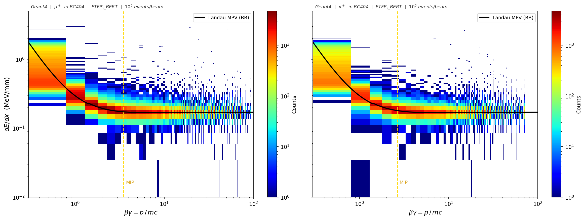
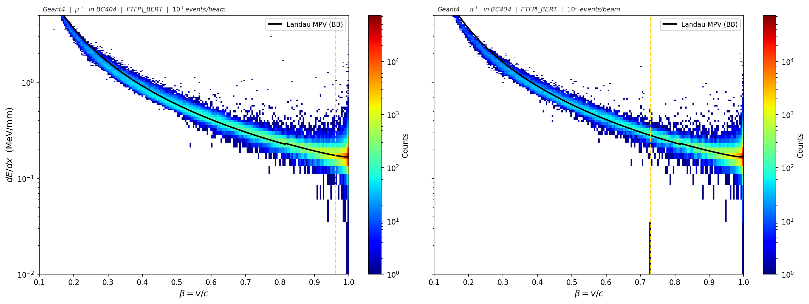
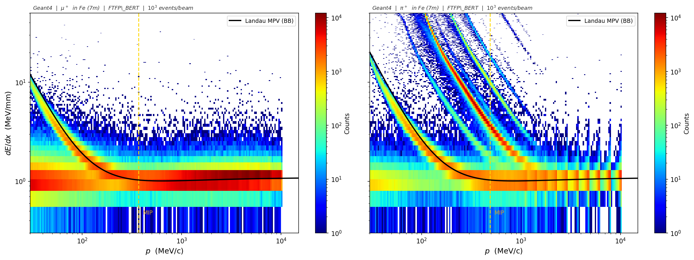
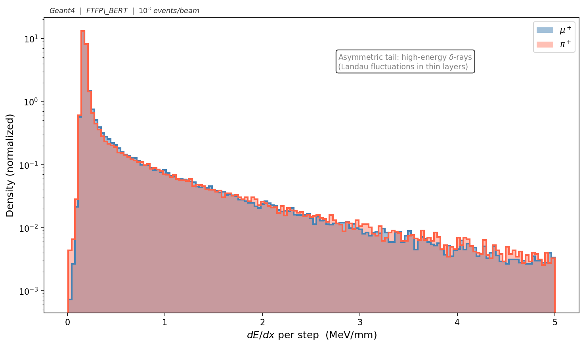
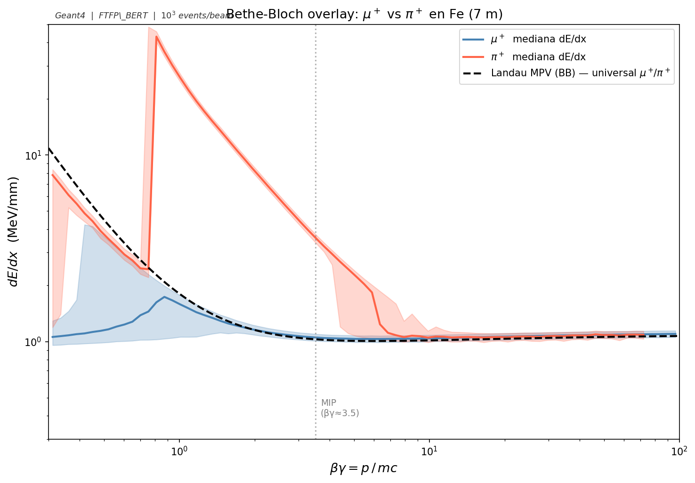

# Simulación Geant4: μ⁺ y π⁺ en detector de hierro

Simulación Monte Carlo de muones y piones positivos en un detector de hierro segmentado, construida con Geant4. Produce los datasets ROOT que alimentan el clasificador μ⁺/π⁺ y permite caracterizar la pérdida de energía de ambas partículas en función de βγ.

---

## Estructura del directorio

```
simulation_mu/        — código fuente y salida para μ⁺
simulation_pi/        — código fuente y salida para π⁺
img/                  — gráficas generadas por plot_bethe_bloch.py
plot_bethe_bloch.py   — script de análisis y visualización
```

---

## Geometría

Ambas simulaciones comparten el mismo detector.

**Volumen del mundo**

| Parámetro | Valor |
|---|---|
| Material | G4_AIR |
| Semi-longitudes (x, y, z) | 0.6 m · 0.6 m · 8.0 m |
| Extensión en z | −8.0 m a +8.0 m |

El mundo tiene 8 m de semi-longitud en z para contener el detector sin recortes hasta z = 7.05 m.

**Detector**

| Parámetro | Valor |
|---|---|
| Material | G4_Fe (ρ = 7.874 g/cm³) |
| Celdas | 100 en total, cuadrícula 10 × 10 en el plano transversal |
| Dimensiones de cada celda | 10 cm × 10 cm × 7 m |
| Centro en z | 3.55 m |
| Rango en z | 0.05 m a 7.05 m |
| Cobertura transversal | −0.5 m a +0.5 m en x e y |

Centro de cada celda en el plano transversal:

```
x_i = -0.5 m + (i + 0.5) × 0.1 m   (i = 0…9)
y_j = -0.5 m + (j + 0.5) × 0.1 m   (j = 0…9)
```

Índice de copia: `j + i×10`.

---

## Lista de física

```
G4EmStandardPhysics       — ionización, bremsstrahlung y procesos EM estándar
G4OpticalPhysics          — fotones ópticos
G4HadronPhysicsFTFP_BERT  — hadrones (BERT < 3–6 GeV, FTFP por encima)
```

Para el μ⁺, los únicos procesos relevantes son los electromagnéticos. Para el π⁺, la parte hadrónica es fundamental: el pión puede interactuar inelásticamente con los núcleos de hierro. En el rango de este barrido (1–10 GeV), las energías del haz de piones están por debajo del umbral de transición BERT-FTFP, de modo que BERT gestiona todas las interacciones hadrónicas.

---

## Fuente primaria y barrido en energía

Cañón de partículas (`G4ParticleGun`) disparando en la dirección +z desde el origen.

| Parámetro | μ⁺ | π⁺ |
|---|---|---|
| Masa | 105.66 MeV/c² | 139.57 MeV/c² |
| Posición inicial | (0, 0, 0) | (0, 0, 0) |
| Dirección | (0, 0, 1) | (0, 0, 1) |

El archivo `barrido_continuo.mac` define el barrido logarítmico en energía cinética:

| Parámetro | Valor |
|---|---|
| Energía mínima | 1.0000 GeV |
| Energía máxima | 10.000 GeV |
| Número de runs | 10 |
| Espaciado | logarítmico uniforme |
| Eventos por run | 1 000 |
| Total de eventos | 10 000 |

Los 10 puntos son: 1.000, 1.292, 1.668, 2.154, 2.783, 3.594, 4.642, 5.995, 7.743 y 10.000 GeV.

Los archivos de salida son `output_run0.root` a `output_run9.root`.

---

## Definición de un hit y variables registradas

Un hit se graba por cada paso de cualquier partícula dentro de un volumen sensible (`G4VSensitiveDetector::ProcessHits`). No hay umbral de energía mínimo. En eventos de pión con cascada hadrónica, una sola celda puede acumular cientos de hits de secundarios.

| Columna ROOT | Descripción | Fuente en Geant4 |
|---|---|---|
| `fEvent` | ID del evento dentro del run | `G4Event::GetEventID()` |
| `fX`, `fY`, `fZ` | Centro geométrico de la celda (mm) | `G4VPhysicalVolume::GetTranslation()` |
| `fEdep` | Energía depositada en el paso (MeV) | `G4Step::GetTotalEnergyDeposit()` |
| `fdEdx` | Energía por longitud de paso (MeV/mm) | `fEdep / GetStepLength()` |
| `Ekin` | Energía cinética al inicio del paso (MeV) | `G4StepPoint::GetKineticEnergy()` |
| `TOF` | Tiempo global al inicio del paso (ns) | `G4StepPoint::GetGlobalTime()` |
| `TrackLength` | Longitud total de traza hasta ese paso (mm) | `G4Track::GetTrackLength()` |
| `ScatteringAng` | Ángulo entre dirección pre-step y post-step (rad) | `dirPre.angle(dirPost)` |
| `Momentum` | Módulo del momento al inicio del paso (MeV/c) | `G4StepPoint::GetMomentum().mag()` |

`fX`, `fY`, `fZ` son el centro geométrico de la celda, no la posición exacta del paso. Todos los hits de una misma celda comparten esos tres valores.

---

## Compilación y ejecución

```bash
cd simulation_mu/build   # o simulation_pi/build
cmake ..
make -j4
./sim ../barrido_continuo.mac
```

---

## Física

### Muón en hierro

El muón es un leptón: no interacciona mediante la fuerza fuerte. Su única forma de perder energía en el hierro es por ionización (más bremsstrahlung a energías muy altas, no relevante aquí). La traza es limpia y recta. En el rango 1–10 GeV, el muón está en la región MIP o ligeramente por encima, con una tasa de pérdida de energía de ~1.1 MeV/mm, coherente con el valor teórico para hierro (~1.14 MeV/mm). Los muones de 1 GeV pueden detenerse antes de salir del detector; por encima de ~3 GeV lo atraviesan sin frenarse del todo.

### Pión en hierro

El π⁺ (quark u + antiquark d̄) pierde energía por ionización igual que el muón, pero además puede interactuar inelásticamente con los núcleos de Fe. Estas interacciones producen espallación nuclear: protones de retroceso, neutrones, partículas α y piones secundarios, todos con su propio registro de hits en el detector. El resultado observable es un depósito de energía total por evento mayor que el del muón, una dispersión lateral fuera del eje del haz, y fluctuaciones evento a evento mucho más amplias que las de Landau pura.

En la región MIP (βγ ≈ 3.5, ~490 MeV/c para el π⁺), el dE/dx del pión por ionización es prácticamente idéntico al del muón. Por encima de 1 GeV, donde opera este barrido, las cascadas hadrónicas son el mecanismo dominante que separa ambas partículas.

---

## Resultados

El script `plot_bethe_bloch.py` genera cinco figuras a partir de los archivos ROOT de ambas simulaciones. La curva analítica en todas las figuras es el valor más probable de Landau (MPV), incluyendo la corrección de densidad de Sternheimer para hierro (parámetros PDG: C = −4.29, x₀ = 0.035, x₁ = 3.15, a = 0.147, m = 2.96).

**Estadística procesada**

| Partícula | Hits totales | Hits en rango [0.3, 50] MeV/mm |
|---|---|---|
| μ⁺ | ~30.4 M | ~14.4 M |
| π⁺ | ~39.8 M | ~13.6 M |

La diferencia en hits totales refleja que las cascadas hadrónicas del pión generan muchos más tracks secundarios por evento.

---

### dE/dx vs βγ



Histograma 2D en escala log-log. El eje x es βγ = p/mc, el eje y es dE/dx en MeV/mm. Para el μ⁺, la distribución de densidad forma una banda continua que sigue la predicción analítica. Para el π⁺, los 10 puntos de energía del barrido aparecen como 10 bandas verticales bien diferenciadas: cada energía de haz produce secundarios cuyas cascadas se distribuyen en un rango de βγ distinto.

---

### dE/dx vs β



En función de β = v/c se aprecia el rising edge no relativista (β < 0.5), el mínimo ionizante alrededor de β ≈ 0.97 (βγ ≈ 3.5), y el plateau de Fermi al acercarse β → 1. Las bandas del π⁺ son más anchas que las del μ⁺ por la variabilidad adicional de las interacciones hadrónicas.

---

### dE/dx vs momento



El MIP del μ⁺ aparece en torno a 370 MeV/c (βγ ≈ 3.5 × 105.66 MeV/c² ≈ 370 MeV/c) y el del π⁺ en ~490 MeV/c. Las 10 bandas verticales del barrido son especialmente pronunciadas en el pión: cada punto de energía genera distribuciones de momento claramente separadas en los secundarios de las cascadas.

---

### Distribución de Landau



Distribución del dE/dx por paso, normalizada, en escala logarítmica. Ambas partículas muestran la asimetría de Landau hacia valores altos, causada por rayos delta de alta energía en capas delgadas. El pico del μ⁺ está desplazado hacia valores menores que el del π⁺. La cola del π⁺ es más pesada: los fragmentos nucleares de las cascadas hadrónicas depositan cantidades de energía muy superiores a las de los δ-rays electromagnéticos del muón.

---

### Overlay μ⁺ vs π⁺



Mediana de dE/dx por bin de βγ para cada partícula, con bandas de dispersión al 25–75 percentil. La curva negra punteada es la predicción analítica de Landau MPV con corrección de Sternheimer. Esta curva es prácticamente idéntica para μ⁺ y π⁺ porque ambas masas son mucho mayores que la del electrón y la fórmula se comporta de modo universal en βγ para partículas con la misma carga.

Las diferencias entre partículas:

- Para βγ < 1, la mediana del π⁺ está por encima de la del μ⁺. Los fragmentos nucleares de las cascadas (protones, partículas α) tienen dE/dx muy alto a bajas velocidades.
- El pico en la curva del π⁺ alrededor de βγ ≈ 0.7 corresponde a absorción nuclear: piones lentos capturados por los núcleos de hierro, liberando fragmentos en el pico de Bragg de ese rango de velocidades.
- Para βγ > 10, ambas curvas convergen sobre la predicción analítica. μ⁺ y π⁺ son indistinguibles por dE/dx en ese régimen; la identificación requiere la forma de la cascada o medidas de tiempo de vuelo.

---

## Dependencias del script de análisis

```bash
pip install numpy matplotlib uproot
```

```bash
python plot_bethe_bloch.py \
    --muon "simulation_mu/build/output_run*.root" \
    --pion "simulation_pi/build/output_run*.root" \
    --out  img/
```
