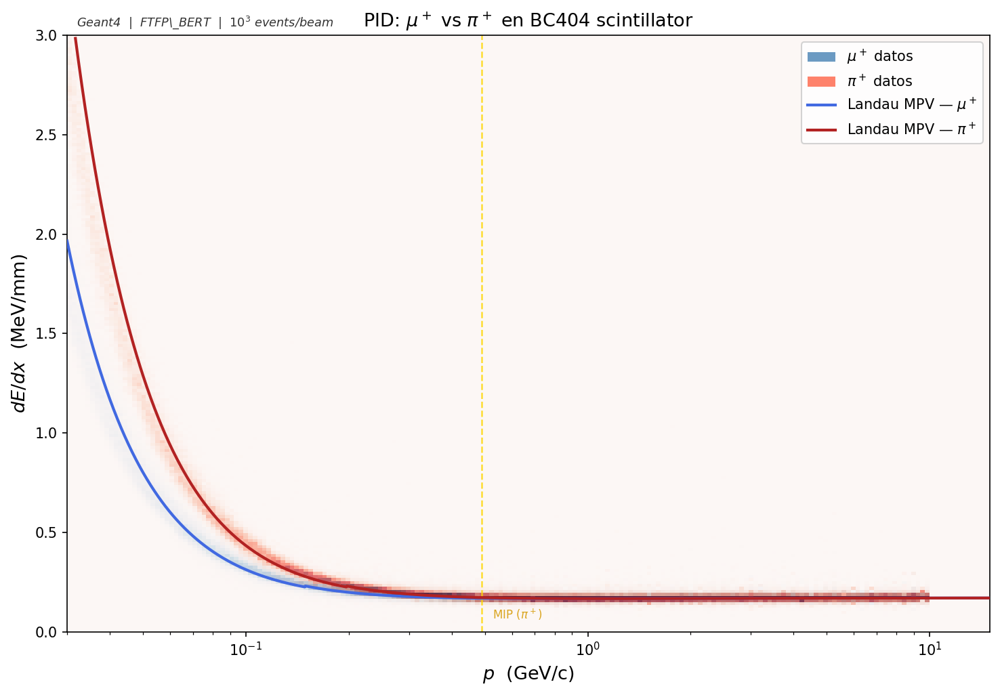
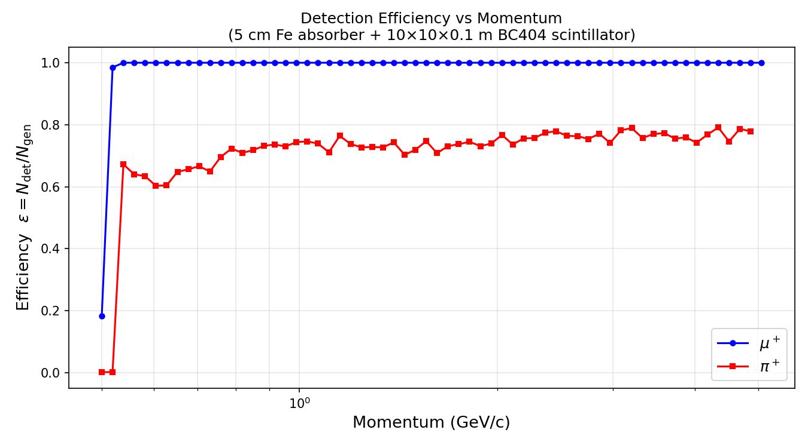

# Simulación Geant4: μ⁺ y π⁺

Dos simulaciones Geant4 independientes disparan muones y piones contra un absorbedor de hierro delgado y registran la respuesta de un centellador plástico ubicado a 1 metro. Los archivos ROOT resultantes alimentan el clasificador XGBoost y los plots de Bethe-Bloch.

---

## Estructura del directorio

```
Pion and muon simulation/
├── simulation_mu/          — fuente Geant4 para μ⁺
│   ├── build/              — binario compilado y mac de ejecución
│   └── barrido_continuo.mac
├── simulation_pi/          — fuente Geant4 para π⁺
│   ├── build/
│   └── barrido_continuo.mac
├── plot_bethe_bloch.py     — genera todas las gráficas a partir de los ROOT
└── img/                    — gráficas guardadas
    ├── bethe_bloch_bg.png
    ├── dedx_vs_beta.png
    ├── dedx_vs_momentum.png
    ├── landau_distribution.png
    ├── bethe_bloch_overlay.png
    ├── pid_combined.png
    └── efficiency_curve.png
```

---

## Geometría

Las dos simulaciones usan el mismo detector.

```
[gun, z=-2m]  →→→  [Fe 5cm]  →→→  [1m vacío]  →→→  [BC404 10×10×0.1m]
               z=0-5cm                           z=105-115cm
```

**Mundo:** vacío (G4_Galactic), 6 m × 6 m × 5 m.

**Absorbedor:** cubo de hierro de 5 cm × 5 cm × 5 cm, centrado en z = 2.5 cm. Los 5 cm equivalen a 0.30 longitudes de interacción nuclear en Fe (lambda_I ~ 16.77 cm), suficiente para frenar piones y muones de bajo momento, insuficiente para detener partículas relativistas.

**Centellador activo (BC404):** placa de 10 m × 10 m × 10 cm de G4_PLASTIC_SC_VINYLTOLUENE (rho = 1.032 g/cm³), centrada en z = 110 cm. El tamaño transversal captura cualquier dispersión lateral. El centellador es el único volumen sensible.

---

## Barrido en momento

80 runs por simulación, espaciados logarítmicamente:

| Parámetro | Valor |
|---|---|
| Rango | 50 MeV/c a 10 000 MeV/c |
| Escala | logarítmica |
| Runs | 80 |
| Eventos por run | 1 000 |
| Comando mac | `/gun/momentumAmp X GeV` |

Geant4 convierte el momento a energía cinética internamente: E_kin = sqrt(p² + m²) - m.

Los runs de bajo momento no producen archivos con datos porque las partículas no alcanzan el centellador:

| Partícula | Runs sin datos | Umbral aprox. |
|---|---|---|
| μ⁺ | 0-17 | p < 170 MeV/c |
| π⁺ | 0-18 | p < 183 MeV/c |

---

## Definición de un hit

Un paso de la **partícula primaria** (TrackID = 1) dentro del volumen BC404. Los secundarios no se registran.

Columnas del árbol `Hits`:

| Columna | Descripción | Unidades |
|---|---|---|
| `fEvent` | ID del evento | entero |
| `fX`, `fY`, `fZ` | Centro del detector (constante: 0, 0, 1100 mm) | mm |
| `fEdep` | Energía depositada en el paso | MeV |
| `fdEdx` | fEdep / longitud del paso | MeV/mm |
| `Ekin` | Energía cinética al inicio del paso | MeV |
| `TOF` | Tiempo de vuelo global | ns |
| `TrackLength` | Longitud total de traza acumulada | mm |
| `ScatteringAng` | Ángulo entre dirección pre-step y post-step | rad |
| `Momentum` | Módulo del momento al inicio del paso | MeV/c |

`fX`, `fY`, `fZ` son constantes en todos los hits (centro del volumen del detector). No son útiles como features en el clasificador.

---

## Compilación y ejecución

```bash
cd simulation_mu/build   # o simulation_pi/build
cmake ..
make -j4
./sim ../barrido_continuo.mac
```

Los archivos de salida se escriben en `../../../Classifier/data/muon/` (o `pion/`).

---

## Gráficas de Bethe-Bloch

```bash
python plot_bethe_bloch.py \
    --muon "../Classifier/data/muon/output_run*.root" \
    --pion "../Classifier/data/pion/output_run*.root" \
    --out  img/
```

El script usa parámetros de material para BC404 (I = 64.7 eV, Z/A = 0.5424, rho = 1.032 g/cm³) y la corrección de densidad de Sternheimer para polímeros orgánicos. Genera 7 plots.

**Estadística procesada**

| Partícula | Archivos | Hits totales | Hits válidos (dE/dx 0.01-5 MeV/mm) |
|---|---|---|---|
| μ⁺ | 62 (runs 18-79) | ~254 000 | ~247 000 |
| π⁺ | 61 (runs 19-79) | ~168 000 | ~163 000 |

La diferencia en hits por run (muones: ~3 400, piones: ~2 400) se debe a que algunos piones se absorben hadrónicamente en el hierro y no alcanzan el centellador.

---

### dE/dx vs βγ


Histograma 2D log-log. Los datos cubren βγ = 1.3-95, trazando la parte descendente de la curva de Bethe-Bloch y el inicio del plateau de Fermi. La curva negra es el Landau MPV analítico para BC404. Los datos siguen la curva porque Geant4 implementa la misma física.

---

### dE/dx vs β


Misma información en función de β = v/c. Los datos del muón aparecen comprimidos cerca de β = 0.85-1.0. El pión, más pesado a igual momento, parte desde β más bajo (~0.75) y traza más de la curva descendente.

---

### dE/dx vs momento (estilo PID)


Eje Y lineal, eje X en GeV/c (log). Es el formato estándar de los plots de identificación de partículas en ALICE o LHCb. La curva descendente desde 0.1 GeV/c hasta el plateau a ~0.5 GeV/c es visible en los datos. Las curvas teóricas de μ⁺ y π⁺ están separadas horizontalmente por el factor m_π/m_μ ≈ 1.32.

---

### Distribución de Landau


Distribución del dE/dx por paso en escala log-Y. La forma asimétrica con cola larga hacia valores altos es la distribución de Landau, característica de capas delgadas. El MPV ronda 0.17-0.20 MeV/mm para BC404. La cola corresponde a pasos con rayos delta energéticos.

---

### Overlay μ⁺ vs π⁺ en βγ


Mediana de dE/dx por bin de βγ para las dos partículas. Se superponen porque la curva de Bethe-Bloch es universal en βγ para partículas con igual carga y masa >> m_electrón. La separación entre μ⁺ y π⁺ desaparece en este eje; para verla hay que pasar a momento.

---

### PID combinado μ⁺ vs π⁺ en momento



Histogramas 2D de las dos partículas en un solo panel. Azul: μ⁺. Rojo: π⁺. A igual momento, el π⁺ deposita más energía porque su mayor masa implica menor βγ, colocándolo en una región más alta de la curva de Bethe-Bloch. La separación es visible entre 0.1 y 0.5 GeV/c. Por encima de 1 GeV/c las curvas convergen en el plateau y el dE/dx pierde poder discriminante.

---

### Curva de eficiencia de detección



Fracción de eventos en que la partícula primaria deposita energía en el centellador, en función del momento inicial. Por debajo del umbral de penetración del absorbedor, la eficiencia es cero: las partículas se detienen en el hierro. La curva sube bruscamente al superar ese umbral y satura cerca de 1 a momentos relativistas. La diferencia entre μ⁺ y π⁺ en la zona de transición tiene origen hadrónico: un pión con momento geométricamente suficiente para atravesar el hierro puede aun así ser absorbido por una reacción nuclear, reduciendo su eficiencia respecto al muón.

---

## Dependencias

```bash
pip install numpy matplotlib uproot
```
