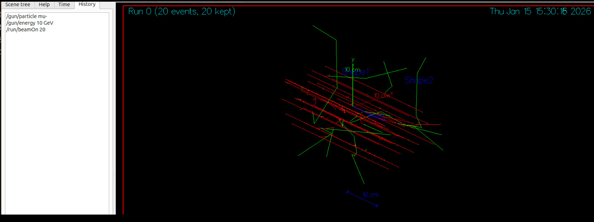

En esta semana (19-Enero-2026) se realizó 2 simulaciones usando muones con carga electrica negativa (\mu -)
Los parametros a utilizar fueron:
Particula: Muon con carga electrica negativa
Energia en primera simulacion: 10 GeV 
Energia en la segunda simulacion: 30 GeV 
Numero de eventos en la primera simulacion: 20 Eventos 
Numero de eventos en la segunda simulacion: 40 Eventos 

# Resultados 

