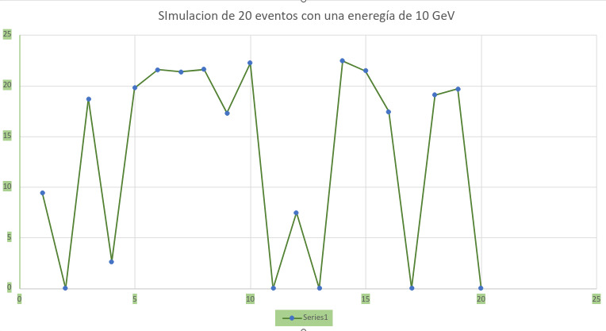
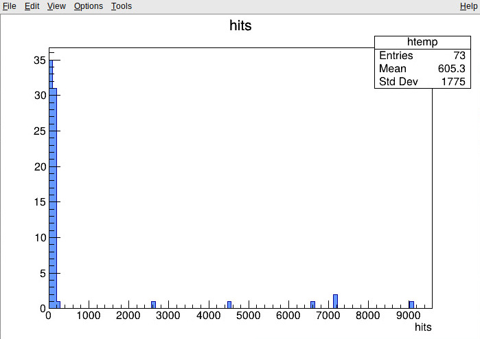
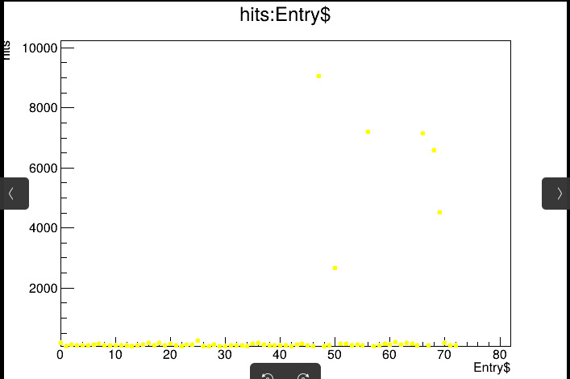
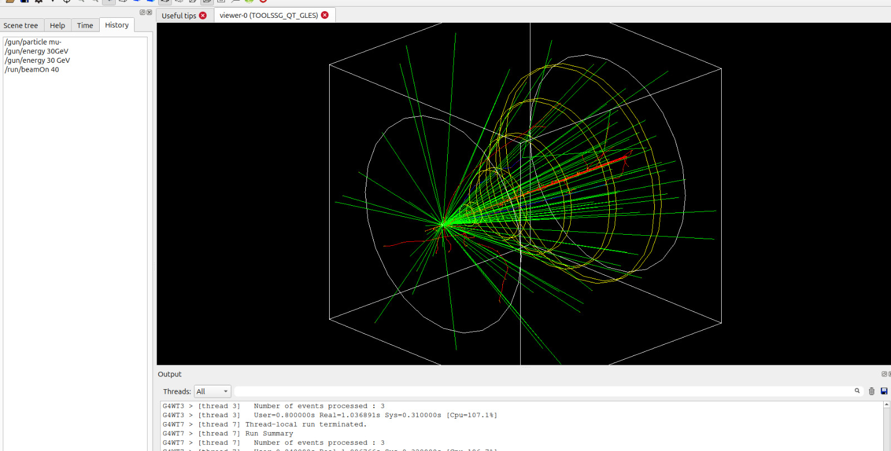
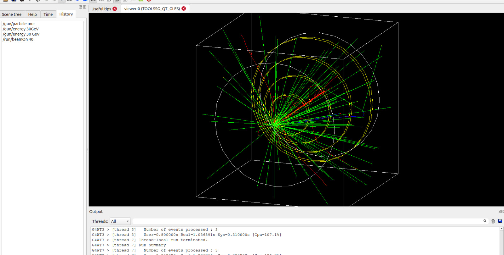

En esta semana (19-Enero-2026) se realizó 2 simulaciones usando muones con carga electrica negativa (\mu -)
Los parametros a utilizar fueron:
Particula: Muon con carga electrica negativa
Energia en primera simulacion: 10 GeV 
Energia en la segunda simulacion: 30 GeV 
Numero de eventos en la primera simulacion: 20 Eventos 
Numero de eventos en la segunda simulacion: 40 Eventos 

In this week (19-January-2026)  two simulations were performed using muons with negative charge (\mu -). Since Geant4 gives us different examples for running simulations, two examples were used to obtain a better analysis.

For the first simulation, the example called " B1" was used for this case. The parameters used during this simulation were the following: 

1. Particle: A muon with negative electric charge
2. Energy: The energy used was 10 GeV
3. Events: We run the simulation for 20 events
   
In the other hand, for the second simulation, the example "B2a" was used for this case. The parameters used were the following: 

1. Particle:A muon with negative electric charge
2. Energy: The energy used was 30 GeV
3. Events: We run the simulation for 40 events

# Resultados 

